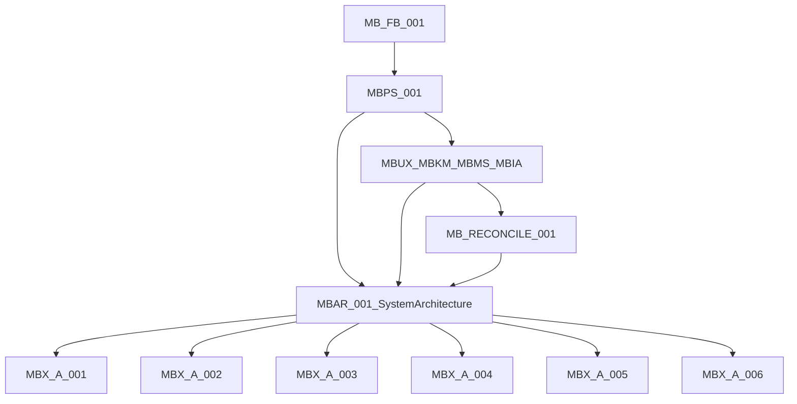
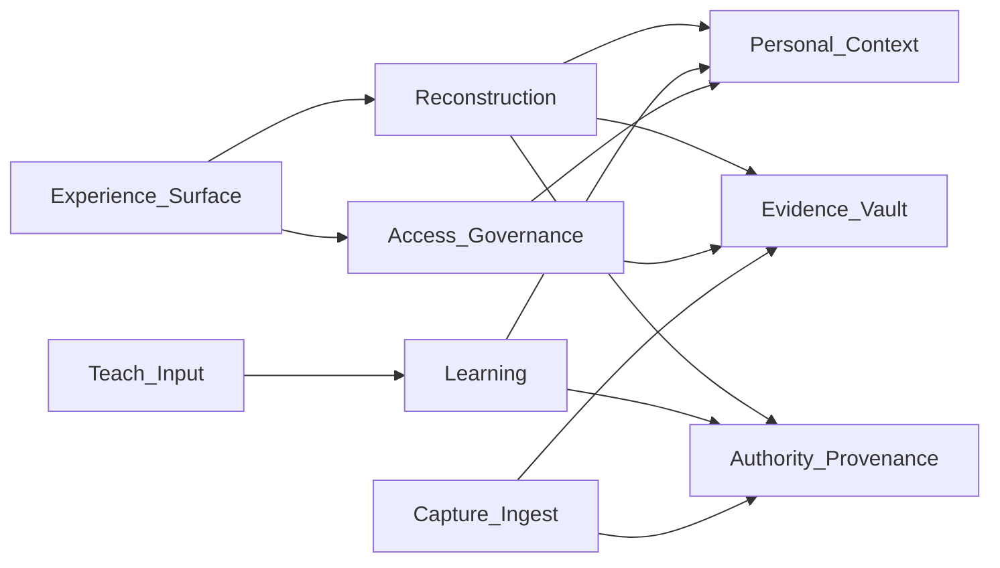
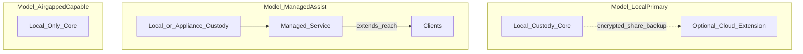

# MBAR-001 — Memory Box System Architecture

| Field | Value |
|-------|--------|
| **Doc ID** | MBAR-001 |
| **Title** | Memory Box System Architecture |
| **Version** | 0.1 |
| **Status** | Governing — overarching technology-neutral system architecture |
| **Authority** | Parent system architecture for engineering. Subordinate to [MB-FB-001](../product/MB-FB-001%20Memory%20Box%20Founders%20Book.md), [MBPS-001](../product/MBPS-001%20Memory%20Box%20Product%20Specification.md), and domain peers ([MBUX-001](../product/MBUX-001%20Memory%20Box%20User%20Experience%20Specification.md) · [MBKM-001](../product/MBKM-001%20Memory%20Box%20Knowledge%20Model.md) · [MBMS-001](../product/MBMS-001%20Memory%20Box%20Mental%20Model.md) · [MBIA-001](../product/MBIA-001%20Memory%20Box%20Information%20Architecture.md)). Terminology: [MB-RECONCILE-001](../product/MB-RECONCILE-001%20Core%20Terminology%20and%20Principles.md). **Governs** [MBX-A-001](MBX-A-001%20Functional%20Architecture%20Part%201.md) through MBX-A-006 as functional elaborations. |
| **Validated by** | [MB-SB-001](../product/MB-SB-001%20Memory%20Box%20Experience%20Storyboards.md) (philosophy, not interface) |
| **Out of scope** | Databases, frameworks, specific LLMs, production infrastructure, sync protocols, concrete permission implementations |

---

## 1. Purpose

This document defines the **system architecture** of Memory Box: responsibilities, boundaries, information flow, authority, provenance, learning loops, shared-archive governance, and deployment models.

It is **technology-neutral**. It does not select storage engines, application frameworks, model vendors, or hosting stacks.

It is the **parent** of the Functional Architecture series:

| Series | Role |
|--------|------|
| **MBAR-001** (this doc) | Overarching system architecture — boundaries, flows, authority, provenance, deployment models |
| **MBX-A-001 … MBX-A-006** | Functional elaborations — principles/query, components, data model, reconstruction, learning, UX binding |



**Conflict rule:** Higher product documents win on intent. MBAR wins over MBX-A-* on system boundaries and commitments. MBX-A-* may deepen mechanism within those boundaries. Terminology clashes resolve per MB-RECONCILE-001.

---

## 2. What the architecture must be

Memory Box is a **Memory Reconstruction Engine**.

It reconstructs understanding from personal evidence. It does not invent memories. It does not replace human judgment.

Architecture succeeds when:

- Every reconstructive claim is traceable to evidence or labeled uncertainty
- Authority and provenance are first-class, not afterthoughts
- Conflicts among perspectives are preserved, not silently flattened
- Modes and lenses change experience without changing archive truth
- Primary custody of identity, sensitive knowledge, and basic operation remains under owner control
- Storyboards’ philosophy holds: understanding over retrieval; curator invites; Story ≠ Narrative; evidence supports and stays available

---

## 3. Architectural commitments

### 3.1 Hard-to-reverse commitments

These are expensive to undo once product and data assume them. Treat as binding unless product law changes.

| ID | Commitment | Rationale |
|----|------------|-----------|
| **C-01** | **Evidence-First reconstruction** — factual claims require support; never invent | FB, MBPS, MB-P-001…003, storyboards |
| **C-02** | **Originals immutable** — processing from working/derived copies; provenance to source | MB-P-002 |
| **C-03** | **Life-graph conceptual model** — product mental model is interconnected life knowledge, not folders/tables | MBKM, MBX-A-001 §13, MBMS anchors |
| **C-04** | **Story ≠ Narrative** — human/curated Story is first-class; AI Narrative is reconstructive assembly | MB-RECONCILE-001 |
| **C-05** | **Artifact / Evidence / Media as roles** (not duplicate object species) | MB-RECONCILE-001 |
| **C-06** | **Claim label quartet** — Facts / Observations / Inferences / Unknowns as engineering truth labels; UX uses human phrasing | MB-P-008, MBUX |
| **C-07** | **Conflict preservation** — competing assertions remain addressable; no silent collapse to one “truth” | This document (authority model) |
| **C-08** | **Local-first custody** — primary custody, identity, sensitive knowledge, and basic operation remain local whenever practical | MB-P-009 extended per Tom sign-off |
| **C-09** | **Owner is steward of access; Memory Box is never the owner** | MBUX, FB privacy stance |
| **C-10** | **Modes change experience, never the archive** | MBMS, MBIA |
| **C-11** | **Evidence invisible by default; always available on request** | MB-RECONCILE-001 |
| **C-12** | **Suggestions are not knowledge** until appropriately confirmed or otherwise elevated under the authority model | MB-P-004; refined in §7 |

### 3.2 Reversible / deferred decisions

Safe to change later; do not freeze in MBAR.

| Area | Status |
|------|--------|
| Storage engine (graph DB, RDBMS, files, hybrid) | Open — implementation |
| App framework, OS packaging, UI toolkit | Open |
| Specific LLM / ASR / vision vendors | Open |
| Sync protocol, CRDT vs lock, conflict-merge algorithm | Open — boundaries only here |
| Concrete ACL/permission schema | Open — roles & policies here |
| Cloud provider / managed hosting | Open — models only (§11) |
| Pets, Organizations, Life Chapters as first-class | **Explicitly unresolved** (MB-RECONCILE-001) |
| MBKM 0.2 Relationship split formalization | Open |
| Default home (Conversation vs Continue Exploring) | Product open |
| Knowledge-graph visualization in Explorer | Product open |

---

## 4. System responsibilities

Map MBPS capabilities onto architectural responsibility domains. Names are capability-facing; internals elaborate in MBX-A-002+.

| Capability (MBPS) | Architectural responsibility | Primary collaborators |
|-------------------|------------------------------|------------------------|
| **Capture** | Ingest media and human input; create immutable originals + working copies; attach initial provenance | Evidence Vault, Provenance, Ingest Boundary |
| **Discover** | Answer curiosity via reconstruction; surface anchors and links; invite next questions | Reconstruction, Personal Context, Experience |
| **Teach** | Accept human assertions, corrections, annotations; record perspective and authority dimensions | Learning, Authority, Personal Context |
| **Learn** | Elevate, demote, or hold suggestions; never silent personal-fact learning | Learning, Authority, Provenance |
| **Remember** | Preserve Stories, confirmed knowledge, and prompts that deepen archive over decades | Personal Context, Story Store, Evidence Vault |
| **Share** | Controlled disclosure under steward rules; read-mostly and contribution paths; revocation | Access Governance, Experience modes |

### 4.1 Responsibility domains (logical systems)



| Domain | Responsibility | Must not |
|--------|----------------|----------|
| **Evidence Vault** | Preserve originals; expose derived views; retrieve by provenance | Modify originals; invent content |
| **Personal Context** | Life-graph knowledge: people, stories, moments, places, links, roles | Treat tables as the product model; silently invent people |
| **Reconstruction** | Plan queries; correlate; assemble Narratives; separate claim types; expose evidence | Present inference as fact; hide uncertainty |
| **Learning** | Process teach/confirm/correct; update context under authority rules | Silent personal-fact promotion |
| **Authority & Provenance** | Record source, assertion type, strength, confidence explanation, perspective, recency, supersession | Flatten conflicts; drop provenance |
| **Access Governance** | Roles, depth, underage, share, revoke, succession | Bypass steward; make MB the owner |
| **Experience Surface** | Conversation, modes, lenses, progressive disclosure | Change archive truth; instruct like enterprise software |

Functional detail of components → **MBX-A-002**. Life-graph schema → **MBX-A-003**. Reconstruction pipeline → **MBX-A-004**. Learning mechanisms → **MBX-A-005**. Experience binding → **MBX-A-006** (subordinate to MBUX).

---

## 5. Boundaries

### 5.1 Inside vs outside the archive

| Inside (archive) | Outside (may influence, not own) |
|------------------|----------------------------------|
| Original evidence and derived views | External world knowledge / web facts (if used, must be labeled non-personal and never silently fused as memory) |
| Personal Context / life graph | Vendor model weights and ephemeral inference scratch space |
| Human Stories and Narratives with provenance | Transient UI session chrome |
| Authority and provenance records | Analytics that identify persons (forbidden as product direction) |
| Access policies and steward designations | Cloud relays that hold durable custody of primary secrets (violates C-08 if primary) |

### 5.2 Layer boundaries (aligned with MBX-A-001)

| From → To | Allowed flow | Forbidden flow |
|-----------|--------------|----------------|
| Evidence → Reconstruction | Retrieved originals/derived views + provenance | Reconstruction rewriting originals |
| Personal Context → Reconstruction | Confirmed and candidate knowledge with authority metadata | Context pretending to be evidence |
| Reconstruction → Experience | Narrative + claim labels + evidence handles + invitations | Raw “Confidence 71%” as primary trust UX |
| Experience → Learning | Teach/confirm/correct/depth choices | Silent acceptance without record |
| Learning → Personal Context | Updates retaining prior conflicting assertions per §7 | Destructive overwrite without supersession record |
| Access Governance → all | Permit/deny/redact by role and depth | Governance by the model vendor |

### 5.3 Story vs Narrative boundary

| | **Story** | **Narrative** |
|--|-----------|---------------|
| Author nature | Human / curated | System assembly from evidence |
| Persistence | First-class archive meaning | Reconstructive answer; may be saved as derived artifact with provenance |
| Authority | High as human assertion (still dimensional — §7) | Bound by evidence and claim labels |
| UX | Anchor / entry (MBMS/MBIA) | Discovery-loop response (MBIA) |

---

## 6. Information flows

### 6.1 Discovery heartbeat (MBIA)

```mermaid
sequenceDiagram
  participant V as Visitor
  participant E as Experience
  participant R as Reconstruction
  participant C as PersonalContext
  participant Ev as EvidenceVault
  participant A as Authority
  participant L as Learning
  V->>E: Question
  E->>R: Interpret request
  R->>C: Context lookup
  R->>Ev: Evidence retrieval
  R->>A: Score assertions / preserve conflicts
  R->>E: Narrative + claims + evidence handles
  E->>V: Narrative first; evidence on request
  V->>E: Teach / confirm / correct / next question
  E->>L: Record teaching event
  L->>C: Update with provenance and supersession
  L->>A: Retain conflicts if unresolved
```

### 6.2 Capture flow (MBPS)

Capture → immutable original in Vault → derived working views → optional provisional links (suggestions, not knowledge) → invite Teach → Learning elevates under authority model → Personal Context enriched → future Discover improves.

### 6.3 Review & Learn (stewardship)

Stewardship is not a second product. Same archive; Contributor / Review & Learn lens. Confirmations raise authority dimensions; rejections record negative evidence; unresolved candidates remain candidates.

### 6.4 Share flow (boundary only)

Steward authorizes a share surface (read-mostly celebration, family night, contribution invite). Recipients operate under role + depth + underage rules (§9). Revocation withdraws future access; prior local copies outside custody are a policy/education problem — architecture requires revocation of **authorized channels**, not magical remote wipe of all human memory.

---

## 7. Authority model

### 7.1 Why not a single ladder

Earlier drafts treated “owner confirmation” as an automatic top rung and “human teaching” as near-absolute. That oversimplifies:

- Humans err, disagree, and speak from limited perspective
- A careless confirmation should not erase strong contradictory evidence
- Multiple narrators may hold incompatible Stories about the same Moment
- Recency and supersession matter; so does evidence strength

**Memory Box models authority as a multi-dimensional record.** Presentation may summarize; storage and reconstruction must not silently flatten.

### 7.2 Authority dimensions

Every assertion in Personal Context (and every reconstructive claim offered as more than Unknown) carries or inherits:

| Dimension | Meaning |
|-----------|---------|
| **Source** | Who/what originated it — person-in-role, system inference, import metadata, external reference |
| **Assertion type** | Fact / Observation / Inference / Unknown (engineering labels); or human Story / annotation / correction |
| **Evidence strength** | Nature and corroboration of supporting evidence (count, independence, original vs derived, conflicts present) |
| **Confidence** | Explained belief — why the system (or human) holds it; not a naked percentage as product truth |
| **Provenance** | Trace to originals, prior assertions, derivation steps, timestamps |
| **Perspective** | Narrator / Contributor viewpoint (Rick vs Tom vs Sue about Peggy) |
| **Recency** | When asserted or last affirmed |
| **Supersession** | Explicit replaces / narrows / disputes links to other assertions — prior retained |

### 7.3 Evaluation rules (normative)

1. **Never invent.** Absence of support ⇒ Unknown or explicit incompleteness.
2. **Suggestions ≠ knowledge.** Inferences and AI proposals remain labeled until teaching events change their dimensions.
3. **Human teaching is high-authority, not absolute.** It weighs heavily on Source and Assertion type, but does not license contradiction of immutable originals, and does not delete competing human perspectives.
4. **Corroborated evidence constrains.** Strong, independent evidence can keep an Inference or even challenge a casual confirmation — the conflict is preserved and surfaced.
5. **Perspective is first-class.** Parallel Stories/assertions may coexist; Reconstruction discloses perspective when it matters.
6. **Supersession is explicit.** Updates link forward/back; history remains auditable.
7. **External knowledge** (if ever used) never outranks personal evidence for personal claims; must be labeled non-personal.

### 7.4 Relation to MB-P-005

MB-P-005 (“Owner Confirmation Is Highest Authority”) remains directionally correct for **disambiguating system suggestions about the owner’s world**, but under MBAR it is interpreted as:

> Owner (or authorized steward) confirmation is the strongest *routine* way to elevate system suggestions — still recorded with full dimensions, still unable to erase evidence or rival perspectives without explicit supersession semantics.

Detailed learning state machines → **MBX-A-005**.

---

## 8. Provenance

### 8.1 Requirements

| Requirement | Statement |
|-------------|-----------|
| **P-01** | Every original has stable identity and ingest provenance (when, how, from where). |
| **P-02** | Every derived view points to its original(s) and derivation kind. |
| **P-03** | Every Narrative cites evidence handles and claim labels for non-Unknown statements. |
| **P-04** | Every Personal Context assertion carries authority dimensions (§7.2). |
| **P-05** | Teaching events are themselves provenance (who taught, when, in what mode/depth). |
| **P-06** | Share and export events are auditable (what left, under which authorization). |
| **P-07** | Redaction/revocation records remain (tombstones or equivalent) so “forgotten from channel” ≠ “history never existed” for steward audit — subject to legal erase requests as a later policy overlay. |

### 8.2 Evidence visibility

Reconstruction and Experience must keep evidence **reachable**. Default presentation may hide the stack (museum, not filing cabinet); trust requires one-step access to supporting material and explanation.

---

## 9. Shared archive governance

Technology-neutral policy architecture. No sync protocol or ACL schema here.

### 9.1 Roles (on Person / session — not separate human species)

| Role | Description |
|------|-------------|
| **Steward** | Ultimate local custody and policy authority for an archive; designates successors; authorizes share and depth defaults |
| **Owner** | Often identical to Steward in single-user archives; product language for the person whose life is centered — may differ in care/succession scenarios |
| **Contributor** | May Teach within granted scopes (people, stories, periods) |
| **Narrator** | Perspective attribution on Stories and assertions |
| **Visitor** | Discover under granted mode/depth; may lack Teach rights |
| **Guardian** | Acts for underage or assisted users within steward rules |
| **Administrator** | Technical health (backup, import, system) — rare; does not own meaning |

A single Person may hold multiple roles. Roles are access/meaning attributions, not competing entity types (MB-RECONCILE-001).

### 9.2 Authority in a shared archive

- Steward sets who may confirm **system-wide** suggestions vs contribute **perspective-bound** Stories
- Contributor teaching is high-authority **within perspective and grant**; it does not automatically rewrite another narrator’s Story
- Conflicts across contributors are preserved (§7)
- Steward (or policy) may mark an assertion as **archive-standard** via explicit supersession — still retaining dissent

### 9.3 Provenance in a shared archive

- Every Teach/Share action attributes actor role and Person
- Imports retain source household/device identity when known
- Narratives disclosed to visitors carry the same claim/evidence obligations unless steward configures a **celebration surface** that still must not invent

### 9.4 Privacy boundaries

| Boundary | Rule |
|----------|------|
| **Custody** | Primary archive custody is local-first (C-08) |
| **Disclosure** | Share is explicit; no ambient social graph |
| **Minimization** | Cloud extensions receive least data needed for the declared purpose (§11) |
| **Surprise** | Prefer forgotten-memory delight over unwanted private discovery; depth controls aggressiveness |
| **Non-ownership** | Memory Box / vendors never become owners of family meaning |

### 9.5 Conversation depth

Depth is a steward- and user-controlled dial over reconstruction aggressiveness and sensitivity:

| Depth (conceptual) | Behavior |
|--------------------|----------|
| Shallow | Safer Narratives; fewer sensitive Inferences; stronger Unknowns |
| Standard | Balanced reconstruction per MBUX trust |
| Deep | More correlation and inference — still labeled; still evidence-backed; still invite Teach |

Depth is **policy + Experience**, not a different archive. Exact UI → MBUX / MBX-A-006.

### 9.6 Underage access

- Underage Mode (MBIA) is mandatory when steward designates a visitor as underage
- Sensitive content governed by steward preferences; wonder-first; contribution limited
- Guardian role may Teach on behalf of underage within policy
- Architecture requires **age-appropriate projection** of the same archive — not a forked false archive

### 9.7 Contribution

- Contribution creates teaching events with full provenance
- Provisional links remain suggestions until elevated
- Guest contribution at celebrations (storyboard open Q) allowed only under time-boxed grants

### 9.8 Revocation

| Revoke | Effect (architectural) |
|--------|------------------------|
| Role grant | Future Teach/Discover under that grant ends |
| Share channel | Authorized remote/experience endpoint stops serving |
| Depth exception | Returns to steward default |
| Assertion | Soft-withdraw via supersession; evidence remains |

Revocation does not rewrite history of what was lawfully taught; it stops ongoing authority of the grant.

### 9.9 Stewardship succession

- Steward may designate **successor steward(s)**
- Succession transfers Access Governance and custody responsibilities, not vendor ownership
- Contested succession is a human/legal process; architecture must support export of custody bundle and clear designation records
- Until succession completes, prior steward policies remain in force

Concrete succession UX and legal templates → later product docs; MBAR only requires the **capability and record**.

---

## 10. Learning loops

### 10.1 Experience learning loop (MBMS)

Explore → Discover → Teach → Remember → Understand → Explore Again

Architecture: each arrow is an event with provenance; Teach enters Learning domain; Remember persists Stories/context; Discover uses Reconstruction.

### 10.2 Knowledge loop (MBMS)

Evidence → Knowledge → Relationships → Stories → Understanding → New Questions

Architecture: Evidence Vault feeds Reconstruction; Learning writes Personal Context; Stories remain human-first-class; Questions return to Experience.

### 10.3 Closed-loop rules

| Rule | Statement |
|------|-----------|
| L-01 | No silent promotion of personal facts from inference alone |
| L-02 | Confirm/correct/reject always recorded |
| L-03 | Negative evidence (rejection) informs future Reconstruction |
| L-04 | Learning never modifies originals |
| L-05 | Learning preserves conflicts pending explicit supersession |

Mechanisms → **MBX-A-005**.

---

## 11. Deployment models

### 11.1 Local-first commitment (hard-to-reverse, not absolute)

**Primary custody, identity material, sensitive Personal Context, and basic Discover/Capture/Teach operation shall remain available under owner/steward control locally whenever practical.**

Cloud services are **not banned**. They may **extend**:

| Extension | Allowed purpose (examples) |
|-----------|----------------------------|
| Sharing | Time-boxed family views, funeral/celebration surfaces |
| Resilience | Encrypted backup / recovery authorized by steward |
| Accessibility | Reach from additional devices without moving primary custody |
| Managed deployment | Optional assisted hosting where steward still controls policy and keys as far as practical |

Cloud must not become silent primary owner of identity or the only copy of the archive.

### 11.2 Model sketches (options — not a selection)



| Model | Intent | Cloud role |
|-------|--------|------------|
| **Local-primary** | Default direction | Optional extensions |
| **Managed-assist** | Steward chooses help operating the system | Extends; custody policy still steward-defined |
| **Airgap-capable** | Archive operable without network for basic loops | None required |

Selection among models is reversible at product packaging level; **abandoning local-capable custody** is hard-to-reverse and rejected by C-08.

### 11.3 Explicitly not decided here

Transport, encryption product, key escrow, multi-device sync algorithm, SaaS region, container orchestration.

---

## 12. Storyboard → architecture traceability

| SB | Philosophy signal | MBAR obligation |
|----|-------------------|-----------------|
| 1 First five minutes | Wonder → Narrative → evidence available → soft teach | Discovery flow §6.1; C-11 |
| 2 Grandpa | Presence; silence; no invention | Reconstruction honesty; Experience restraint |
| 3 China Trip | Forgotten media → human Story | Capture + Story boundary §5.3 |
| 4 Pocket Watch | Meaning > media | Artifact role; KnowledgeLinks (naming → MBKM 0.2) |
| 5 Review & Learn | Stewardship as joy | Learning loop; Contributor path |
| 6 Recording a Story | Capture easier than organization | Capture flow; offline-then-sync remains open |
| 7 Family Night | Multi-gen same archive | Modes; shared roles §9 |
| 8 Explorer Mode | Power without new product | Lenses; same archive C-10 |
| 9 Memory Care | Dignity; compose modes | Mode composition; depth; Guardian |
| 10 Funeral | Share / celebration | Share flow; revocation; no invention |

---

## 13. Decision register (ADR-style)

### ADR-001 — Parent architecture series

- **Decision:** MBAR-001 parents MBX-A-001…006
- **Status:** Accepted (Tom sign-off)
- **Reversibility:** Hard (doc hierarchy)

### ADR-002 — Multi-dimensional authority

- **Decision:** Replace single absolute ladder with source × assertion type × evidence strength × confidence × provenance × perspective × recency × supersession; preserve conflicts
- **Status:** Accepted
- **Reversibility:** Hard once data model assumes flat confidence only
- **Follow-up:** MBX-A-003 / A-005

### ADR-003 — Local-first with cloud extensions

- **Decision:** C-08 as stated; cloud may extend share/resilience/accessibility/managed deploy
- **Status:** Accepted
- **Reversibility:** Hard to abandon local-capable custody; choice of extension vendors reversible

### ADR-004 — Shared-archive policy without sync tech

- **Decision:** Roles, depth, underage, contribution, revocation, succession specified as architecture; sync/ACL implementation deferred
- **Status:** Accepted
- **Reversibility:** Role vocabulary moderately sticky; protocols reversible

### ADR-005 — Life-graph conceptual primacy

- **Decision:** Affirm MBX-A-001 §13; storage tech open
- **Status:** Accepted
- **Reversibility:** Hard for product mental model; storage reversible

### ADR-006 — Unresolved product ontology

- **Decision:** Pets, Organizations, Life Chapters-as-anchor, Favorites/Values/Beliefs first-class status, MBKM 0.2 relationship rename — **explicitly open**; do not invent in MBAR
- **Status:** Accepted
- **Reversibility:** N/A

### Open ADRs (to resolve later)

| ID | Question | Notes |
|----|----------|-------|
| ADR-007 | Offline capture then sync mental model | Storyboard open; needs product + later sync ADR |
| ADR-008 | Contested stewardship legal workflow | Beyond architecture records |
| ADR-009 | External knowledge use policy | Default: avoid for personal claims |
| ADR-010 | Celebration surfaces vs full trust UX | How much claim labeling in funeral mode |
| ADR-011 | Multi-archive households | One steward vs federation |

---

## 14. Explicitly unresolved (do not invent)

Carried from MB-RECONCILE-001 and product opens:

1. Pets — first-class / specialization / out of model  
2. Organizations — first-class vs specialization  
3. Favorites, Values, Beliefs — first-class vs specializations  
4. Life Chapters as fifth anchor  
5. MBKM 0.2 — SocialRelationship / KnowledgeLink formalization and role matrix  
6. Stories vs People as primary interface anchor  
7. Knowledge-graph visualization in Explorer  
8. Default home: Conversation vs Continue Exploring  
9. MBCP-001 canonization  
10. Sync technology and concrete permission implementation  
11. Specific databases, frameworks, LLMs, production infrastructure  

Personal Context in MBX-A-001 may *mention* pets/organizations as examples of learned world knowledge; that does **not** freeze them as first-class ontology in MBAR.

---

## 15. Success criteria for this architecture

Architecture is adequate when engineering can:

- Place any feature in a responsibility domain without crossing forbidden boundaries  
- Trace Ask → Narrative → Evidence → Teach → Learn without invention  
- Represent disagreement without data loss  
- Explain how local-first custody holds under a chosen deployment model  
- Delegate detail to MBX-A-002…006 without rewriting MBAR  

---

## 16. Delegation map

| Concern | Home |
|---------|------|
| Evidence-First principles, query grammar, personal context sketch | [MBX-A-001](MBX-A-001%20Functional%20Architecture%20Part%201.md) |
| Component responsibilities inside domains | MBX-A-002 (planned) |
| Canonical life-graph data model | MBX-A-003 (planned) ← MBKM + MB-RECONCILE-001 + §7 dimensions |
| Query planning & reconstruction pipeline | MBX-A-004 (planned) |
| Learning state machines & promotion rules | MBX-A-005 (planned) |
| UX binding to layers | MBX-A-006 (planned) ← subordinate to MBUX |
| Product terminology | [MB-RECONCILE-001](../product/MB-RECONCILE-001%20Core%20Terminology%20and%20Principles.md) |
| Implementation stack | MBTS-001 (planned) — after architecture series |

---

## Document control

| | |
|--|--|
| **What we decided** | Publish MBAR-001 as technology-neutral parent system architecture with multi-dimensional authority, local-first custody allowing cloud extensions, and shared-archive governance without sync/ACL implementation. |
| **Why** | Give A-002…A-006 and future MBTS a single boundary document derived from reconciled product law and validated storyboards. |
| **Open questions** | See §13 open ADRs and §14 unresolved ontology. |
