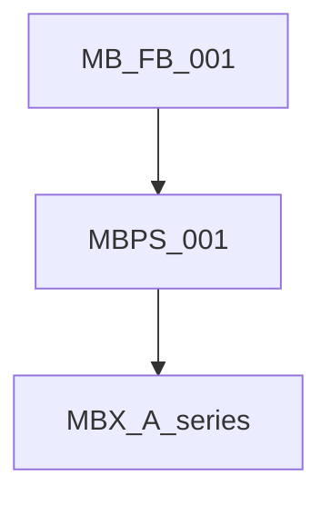

# MBX-A-001-RECONCILE — Founder's Book and MBPS vs Functional Architecture

| Field | Value |
|-------|--------|
| **Doc ID** | MBX-A-001-RECONCILE |
| **Related** | [MB-FB-001](../product/MB-FB-001%20Memory%20Box%20Founders%20Book.md), [MBPS-001](../product/MBPS-001%20Memory%20Box%20Product%20Specification.md), [MBX-A-001](MBX-A-001%20Functional%20Architecture%20Part%201.md) |
| **Status** | Report only — no implementation |
| **Purpose** | Keep Functional Architecture honest relative to the product hierarchy |

**Classification legend**

| Label | Meaning |
|-------|---------|
| **Aligned** | Same intent; safe to treat as reinforcing |
| **Partial** | Overlap; incomplete coverage on one side |
| **Conflict** | Tension that must be resolved in favor of the higher document (or by explicit amendment) |
| **Extends** | Higher product doc adds scope not yet in MBX-A-001 |

---

## 1. Authority reassignment

**Binding hierarchy (Tom, 2026-08-03):**

1. **MB-FB-001 Founder's Book** — living constitution (why / philosophy / ethics)
2. **MBPS-001 Product Specification** — WHAT the product is
3. **MBX-A-*** — HOW functionally (layers, query, reconstruction, learning, data model)

Conflict rule: higher wins on product intent. MBX-A-* must not knowingly violate Founder's Book or MBPS. MBX-A-* Evidence-First specificity (including Facts / Observations / Inferences / Unknowns) stands unless higher docs contradict it — they reinforce never-invent and human-high-confidence; they do not contradict the quartet.

MBX-A-001 is **not** the top product constitution. It is functional/engineering architecture under the product docs.

---

## 2. Concept map

| Founder's / MBPS concept | MBX-A-001 / life graph | Status | Notes |
|--------------------------|------------------------|--------|-------|
| Person | Personal Context (people); graph person nodes (§13) | **Aligned** | Both treat people as anchors. |
| Story (human-written, first-class) | Story / narrative as Reconstruction **output**; not a durable first-class object in Part 1 | **Extends** | Product elevates human Stories as first-class citizens. Part 3/6 must model Story nodes, not only AI Narrative. |
| Narrative (AI-assembled from evidence) | Reconstruction Layer narrative generation | **Aligned** | MBPS separates Story (human) vs Narrative (AI); MBX-A-001 “story reconstruction” maps to Narrative. Naming should stay distinct going forward. |
| Moment | Temporal model / Event / personal eras (§8) | **Partial** | MBX-A has time dimensions; Moment as named product object awaits Part 3 / MBDM. |
| Place | Place in query model + Personal Context; place graph Missing in prototype | **Aligned** intent / **Partial** delivery | |
| Thing | Not named in MBX-A-001 | **Extends** | Physical/meaningful non-media objects; fold into Artifact or distinct graph node in Part 3. |
| Artifact | Evidence media types + broader “anything meaningful” | **Extends** | MBPS Artifact ⊇ MBX-A Evidence sources; includes keepsakes, recipes, medals, journals, voice memos. |
| Evidence | Evidence Layer; MB-P-001 | **Aligned** | MBPS: information supporting a narrative. |
| Relationship | Personal Context + Learning; relationship graph Missing in prototype | **Aligned** intent | |
| Contributor | Not in MBX-A-001 | **Extends** | Multi-person authorship/sharing; Part 5/6 and Share capabilities. |
| User (perspective center) | Owner identity / second-person Ask | **Partial** | MBPS User re-centers the graph; prototype is single-owner archive. Family/User switching is product extension. |
| Personal knowledge graph (§13) | Human model (People, Stories, …) interconnected | **Aligned** | Same conceptual direction; different vocabulary. |

---

## 3. Principles map

| Higher-doc principle | MBX-A principle | Status |
|----------------------|-----------------|--------|
| Never invent / never create false memories | MB-P-003, Core Philosophy §2 | **Aligned** |
| Ask when uncertain; thoughtful questions | MB-P-004, §7 Knowledge Acquisition | **Aligned** |
| Human input very high confidence / outweighs AI | MB-P-005, Learning Hierarchy §10 | **Aligned** |
| Evidence-first / fact based / confidence biased | MB-P-001, MB-P-006, MB-P-008 | **Aligned** |
| Always preserve provenance | MB-P-002 | **Aligned** |
| People are the anchors | Personal Context; Person in query model | **Aligned** |
| Stories first-class (human-written) | Reconstruction outputs narrative; Story object not defined | **Extends** |
| Artifacts gain value from meaning; meaning > media | MB-P-010 contextual memory | **Aligned** |
| Capture easier than organization | Not in MBX-A-001 Part 1 | **Extends** (Capture capability / UX) |
| Trust before convenience; privacy / depth control | Local First MB-P-009; tone/privacy partly parked | **Partial** |
| Users control privacy and conversation depth | Part 6 / open MBPS questions | **Extends** |
| Life doesn't live in folders | §12 not a DMS/search engine | **Aligned** |
| Surprise with forgotten memories, not unwanted discoveries | Soft product ethic; relates to tone dial parked PRD | **Extends** / Part 6 |

MB-P-008 quartet (Facts / Observations / Inferences / Unknowns) is **compatible** with Founder's “fact based and confidence biased” and MBPS never-fabricate. Keep as engineering canonical labels.

---

## 4. Capability map (MBPS §5)

| Capability area | vs MBX-A-001 | vs current prototype (high level) | Status |
|-----------------|--------------|-----------------------------------|--------|
| **Capture** (voice, email, SMS, photo annotate, scan, import, physical catalog) | Part 1 Evidence Layer lists media; Capture flows not specified | Email/calendar/photo/SMS ingest strong; voice/physical/scan weak or absent | **Extends** |
| **Discover** (Ask, people, stories, places, timeline, collections) | Reconstruction + query model + outputs | Ask + Timeline + Evidence; Stories/Collections/Places exploration thin | **Partial** |
| **Teach** (user input high confidence; identify faces/speech/relations/places) | Learning + Personal Context; owner confirmation | Clarify save people; Immich faces; no speech/place teach loop | **Partial** / **Extends** |
| **Learn** (confirm faces/speakers/places/relations; story enrichment; confidence) | Learning Layer §4; hierarchy §10 | Bootstrap clarify only | **Partial** |
| **Remember** (life interview, prompts, weekly capture, voice storytelling) | Not in Part 1 | Absent | **Extends** |
| **Share** (family, read-only, memory care, funeral, export) | Not in Part 1; Founder's future vision | Absent | **Extends** |

---

## 5. Flow map (MBPS §7)

| MBPS flow | MBX-A-001 / pipeline | Status |
|-----------|----------------------|--------|
| Ask → Narrative → Evidence → Feedback → Learning | Ask retrieve → Pass-1/2 narrative → citations; Feedback/Learning thin | **Partial** — Feedback→Learning not a closed product loop |
| Capture → Transcribe → Understand → Link → Save | Ingest scripts + archive policy; no general Capture pipeline in Part 1 | **Extends** |
| Review → Confirm → Improve → Rediscover | Propose/confirm intended (MB-P-004/005); parked people PRD | **Partial** |
| Story → Share → Preserve | Story first-class + Share | **Extends** |

Structured query grammar and reconstruction **planner** (Part 4) are HOW Discover/Ask should work; they remain subordinate elaborations of MBPS Discover, not competing product definitions.

---

## 6. Conflicts / Extends (explicit)

### Conflicts

1. **None hard on Evidence-First / never-invent.** Higher docs and MBX-A-001 agree.
2. **Naming: Story vs Narrative.** Soft conflict if engineering calls AI output “Story” while MBPS reserves Story for human-written first-class objects. **Resolution:** use **Narrative** for AI-assembled answers; **Story** for human (or human-owned) first-class objects in Part 3/6.
3. **“User” vs single archive owner.** MBPS User-centric multi-perspective graph vs prototype single-owner Ask. Not a principle conflict; product scope extension. v1 may stay owner-centered if MBPS v1 out-of-scope items and open questions allow.

### Extends (product scope beyond MBX-A-001 Part 1)

- Human **Story** as first-class object  
- **Contributor**, family sharing, memory care, funeral presentations  
- **Capture** and **Remember** capability families  
- **Thing** / physical artifact cataloging  
- Broader **Artifact** taxonomy than digital evidence stores  
- Privacy / conversation-depth controls as product features  
- Progressive disclosure / “family historian not enterprise software” design goals (Part 6)

---

## 7. Implications for Parts 2–6 and MBKM / MBDM

| Upcoming doc | Implication |
|--------------|-------------|
| **MBX-A-002** Layers | Map Evidence / Personal Context / Reconstruction / Learning to MBPS Capture–Share and Founder's human model; name Narrative vs Story clearly. |
| **MBX-A-003** / **MBDM-001** / **MBKM-001** | One life-graph conceptual model: Person, Story, Moment, Place, Thing/Artifact, Evidence, Relationship, Contributor, Time. Do **not** fork MBDM away from MBX-A-003. |
| **MBX-A-004** Pipeline | Realize Ask→Narrative→Evidence→Feedback→Learning with structured query + planner (not top-N-only RAG). |
| **MBX-A-005** Learning | Teach/Learn confirm loops; human input = top of hierarchy; Story enrichment. |
| **MBX-A-006** / **MBUX-001** | Warm/calm/curious UX; capture easier than organize; privacy depth; tone (“forgotten not unwanted”). |
| **MBTS-001** | Technical binding after conceptual model; storage may be relational under the graph conceptual model (§13). |

---

## 8. Bottom line

Founder's Book and MBPS **raise the product ceiling** (Stories, Capture, Remember, Share, Contributors) while **reinforcing** the Evidence-First core already in MBX-A-001. Functional Architecture remains the HOW document and must stay subordinate. No implementation is authorized by this reconciliation alone.
