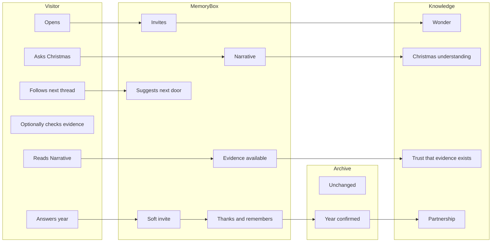
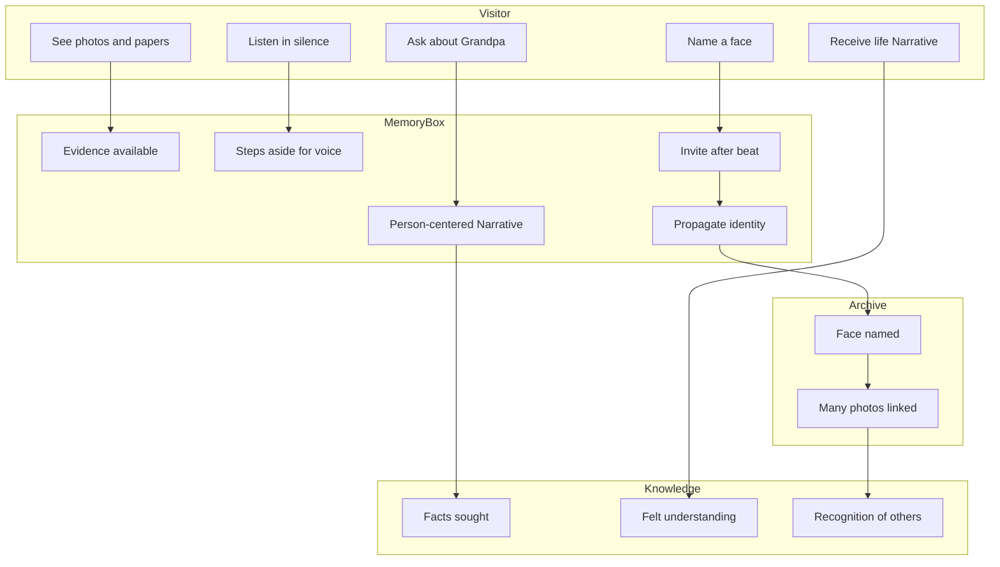
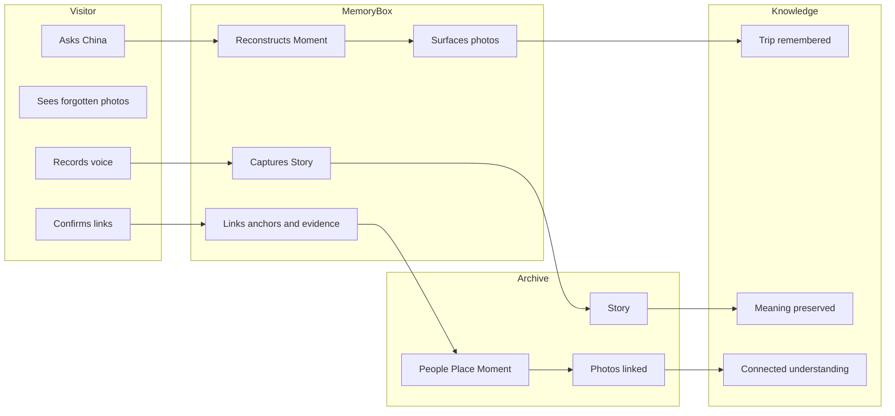
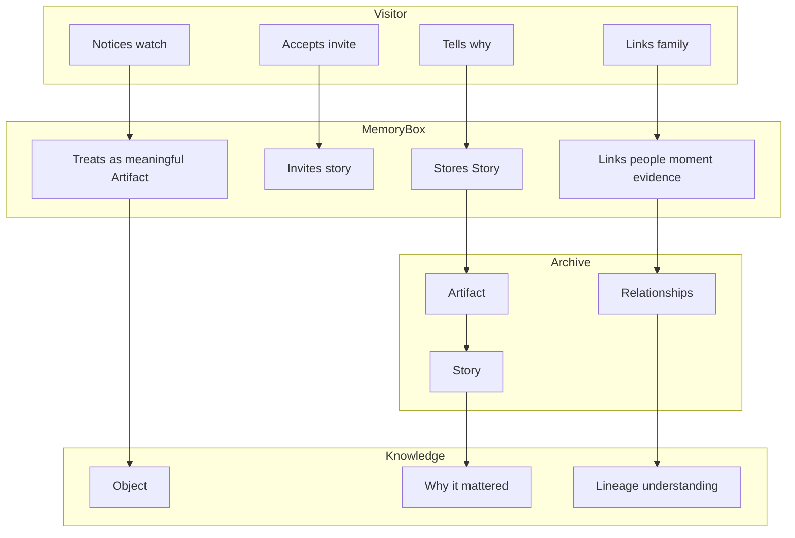
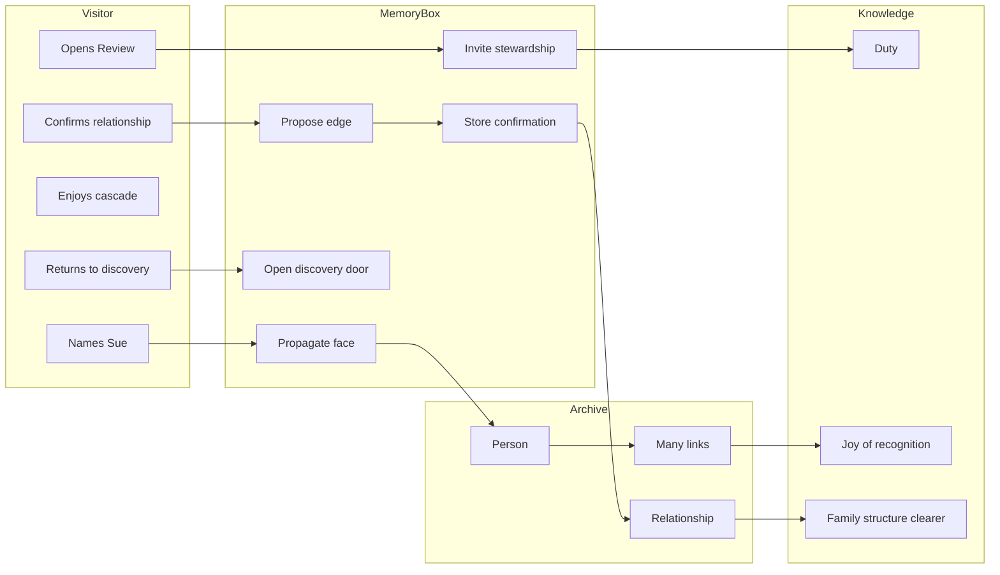
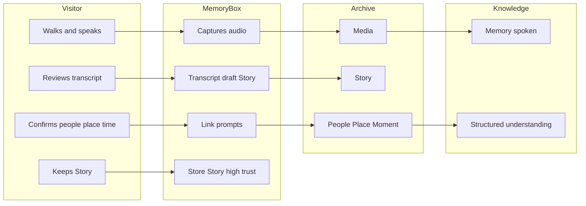
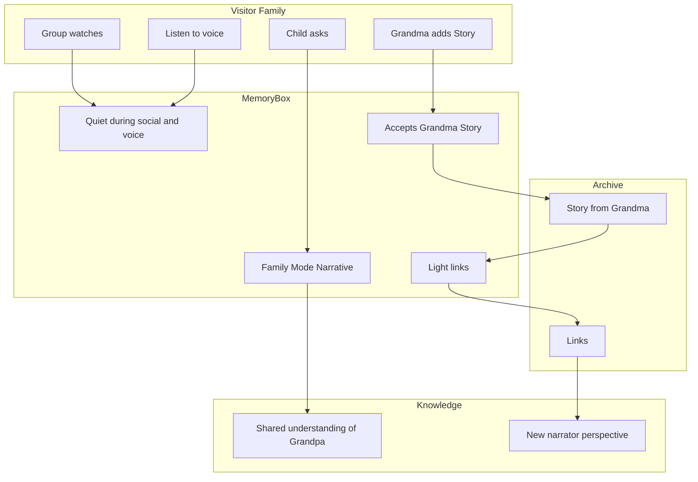
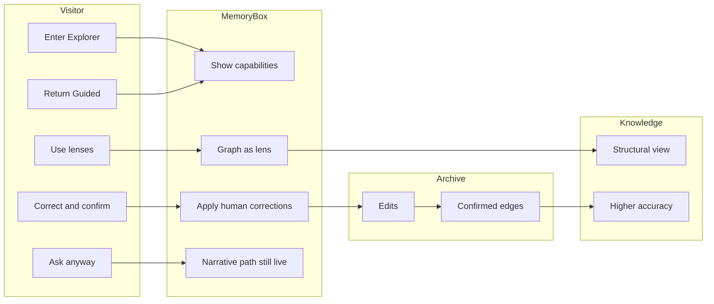
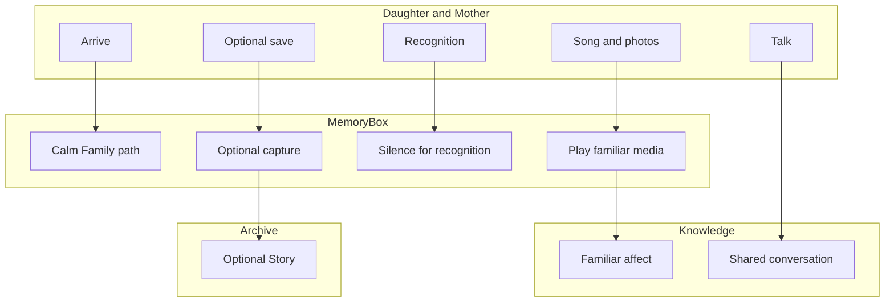
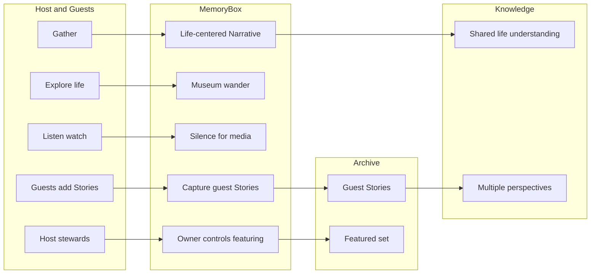

# MB-SB-001 — MemoryBox Experience Storyboards

| Field | Value |
|-------|--------|
| **Doc ID** | MB-SB-001 |
| **Title** | Experience Storyboards — Validation v0.1 |
| **Status** | Experience validation |
| **Binding purpose** | **Validate philosophy, not interface.** If a beat solves layout or chrome, it is out of scope. |
| **Casting** | Visitor = main character · MemoryBox = museum curator · UI = supporting actor only |
| **Sources** | MB-FB-001, MBCP-001 (draft), MBPS-001, MBUX-001, MBKM-001 (draft), MBMS-001 (draft), MBIA-001 (draft) |

## Pass / fail for the set

Does MemoryBox still feel like a **living museum with a quiet curator** — not like software to operate?

## Panel field guide

| Field | Meaning |
|-------|---------|
| Visitor Emotion | Curious · Surprised · Reflective · Happy · Emotional · Delighted · Proud · Connected |
| Visitor Goal | What they hope to accomplish |
| Visitor Action | What they actually do |
| MemoryBox Response | Curator behavior (never “Confidence 71%” / “Unknown Person #”) |
| Knowledge Gained | New understanding |
| Archive Enrichment | How the archive got richer (or none yet) |
| Next Curiosity | What naturally prompts another question |

## Four artifacts per storyboard

1. **One-page storyboard** — Disney/Pixar boxes (narrative beats, not UI regions)  
2. **Journey map** — swimlanes: Visitor · MemoryBox · Knowledge · Archive  
3. **Interaction Notes** — why MB behaved that way (MBUX / MBIA / MBMS / MBCP)  
4. **Questions** — philosophy validation answers  

---

# Storyboard 1 — The First Five Minutes

**Thesis:** Goal = “I wonder what this thing can do.” Desired emotion = Wonder. Ending = Confidence.

**Mode / entry:** Guided Exploration · Conversation (MBIA front door)

## 1. One-page storyboard

```text
[1 Wonder] --> [2 Ask] --> [3 Narrative] --> [4 Evidence available]
        \                                         |
         \                                        v
          ------------------> [5 Soft invite] --> [6 Taught] --> [7 Next door]
```

### Panel 1 — Threshold
- **Visitor Emotion:** Curious  
- **Visitor Goal:** See what this is  
- **Visitor Action:** Opens MemoryBox  
- **MemoryBox Response:** Quiet invitation — *What would you like to explore today?* No folders. No tour.  
- **Knowledge Gained:** This might be about people, not files  
- **Archive Enrichment:** None yet  
- **Next Curiosity:** What can I ask?

### Panel 2 — The ask
- **Visitor Emotion:** Curious  
- **Visitor Goal:** Test it with something human  
- **Visitor Action:** *Tell me about Christmas at our house*  
- **MemoryBox Response:** Accepts the question as conversation, not a search string  
- **Knowledge Gained:** —  
- **Archive Enrichment:** None  
- **Next Curiosity:** Waiting for the answer’s shape  

### Panel 3 — Understanding arrives
- **Visitor Emotion:** Surprised → Delighted  
- **Visitor Goal:** Understand, not retrieve  
- **Visitor Action:** Listens / reads the Narrative  
- **MemoryBox Response:** Warm second-person Narrative of Christmas; people and place named; no dump of files  
- **Knowledge Gained:** A coherent Christmas memory reconstructed from evidence  
- **Archive Enrichment:** None yet  
- **Next Curiosity:** Is that really from our photos?

### Panel 4 — Trust without stealing the beat
- **Visitor Emotion:** Reflective  
- **Visitor Goal:** Know this isn’t made up  
- **Visitor Action:** Optionally opens why / evidence  
- **MemoryBox Response:** Evidence available behind the Narrative; confidence in human language (*reasonably confident…*)  
- **Knowledge Gained:** Answers are supported; uncertainty is honest  
- **Archive Enrichment:** None  
- **Next Curiosity:** Some pictures still lack years  

### Panel 5 — Invitation, not homework
- **Visitor Emotion:** Connected  
- **Visitor Goal:** Help a little if asked kindly  
- **Visitor Action:** Hears an invite about timing  
- **MemoryBox Response:** *Do you happen to remember about when this picture was taken?* Never “metadata missing.”  
- **Knowledge Gained:** The system wants partnership  
- **Archive Enrichment:** Pending  
- **Next Curiosity:** I could answer that  

### Panel 6 — Teaching remembered
- **Visitor Emotion:** Proud  
- **Visitor Goal:** Leave something better  
- **Visitor Action:** Confirms a year  
- **MemoryBox Response:** *Thank you. I’ll remember that.*  
- **Knowledge Gained:** Teaching matters  
- **Archive Enrichment:** Date linked to photos / moment  
- **Next Curiosity:** Who else is in that living-room photo?

### Panel 7 — Confidence
- **Visitor Emotion:** Confident (closing)  
- **Visitor Goal:** Know how to continue  
- **Visitor Action:** Follows a natural next thread (person or continue Christmas)  
- **MemoryBox Response:** Opens another door without a menu  
- **Knowledge Gained:** I can ask anything like this  
- **Archive Enrichment:** Carry-forward from panel 6  
- **Next Curiosity:** Already forming the next question  

## 2. Journey map



## 3. Interaction Notes

- **MBMS / MBIA:** Conversation is the front door; no hierarchical home.  
- **MBUX Ch 1 / Wonder:** First successful ask should feel “Wait… I can ask that?”  
- **MBUX never-say / MB-P-006:** Human confidence phrasing; evidence available, not dominant.  
- **MBCP P4 / P5 / P6:** Invite; family teaches; interaction enriches.  
- **MBKM:** Narrative (AI) ≠ Story (human); this beat is Narrative.

## 4. Questions — validation

| Question | Answer |
|----------|--------|
| Where was the experience confusing? | Low risk if “Continue yesterday” appears before first wonder — may feel like unfinished software. Prefer empty-curious threshold first. |
| Where did MB feel too much like software? | If evidence chips lead the frame before Narrative, or if invite feels like a required form. |
| Where did the curator disappear? | If Panel 1 is a dashboard of tools. |
| Which Core Principles were exercised? | P1 People; P3 Curator; P4 Invite; P5 Family teaches; P6 Enrich; P7 Trust; P15 Wonder; Final principle (understanding). |
| Which MBUX chapters were validated? | Promise/Wonder; Conversation; Invitation; Trust visible; Narrative first (Ch 20 spirit). |
| New questions raised? | Should first-run omit “Continue” until a conversation exists? How many soft invites before feeling nagged? |

**Verdict:** Philosophy holds if Narrative leads and teaching is optional invitation.

---

# Storyboard 2 — Grandpa

**Thesis:** Arrives wanting facts. Leaves feeling they spent time with Grandpa.

**Mode / entry:** Guided · Conversation / Person

## 1. One-page storyboard

```text
[1 Facts?] --> [2 Narrative of a life] --> [3 Photos] --> [4 Papers as evidence]
                                                      |
                                                      v
                                              [5 Voice + SILENCE]
                                                      |
                                                      v
                                              [6 Introduce face] --> [7 Archive blooms] --> [8 Spent time]
```

### Panel 1 — Arrives for facts
- **Visitor Emotion:** Curious  
- **Visitor Goal:** Get information about Grandpa  
- **Visitor Action:** *Tell me about Grandpa*  
- **MemoryBox Response:** Treats Grandpa as a Person anchor, not a contact record  
- **Knowledge Gained:** —  
- **Archive Enrichment:** None  
- **Next Curiosity:** Who was he, really?

### Panel 2 — Time with a person
- **Visitor Emotion:** Reflective  
- **Visitor Goal:** Understand Grandpa  
- **Visitor Action:** Receives Narrative of life patterns with citations waiting  
- **MemoryBox Response:** Behavioral, warm, Evidence First — not a cartoon biography  
- **Knowledge Gained:** A sense of Grandpa’s life, not a fact sheet alone  
- **Archive Enrichment:** None  
- **Next Curiosity:** Show me  

### Panel 3 — Photographs as presence
- **Visitor Emotion:** Connected · Emotional  
- **Visitor Goal:** See him  
- **Visitor Action:** Looks at photos in the story’s flow  
- **MemoryBox Response:** Photos serve the Narrative; not a gallery app  
- **Knowledge Gained:** Visual presence of Grandpa  
- **Archive Enrichment:** None  
- **Next Curiosity:** What else survives?

### Panel 4 — Papers support, don’t replace
- **Visitor Emotion:** Surprised  
- **Visitor Goal:** Verify / deepen  
- **Visitor Action:** Notices military papers as evidence  
- **MemoryBox Response:** Evidence behind understanding  
- **Knowledge Gained:** Documentary support for service years  
- **Archive Enrichment:** None  
- **Next Curiosity:** His voice?

### Panel 5 — Silence
- **Visitor Emotion:** Emotional  
- **Visitor Goal:** Hear Grandpa  
- **Visitor Action:** Plays voice; stays with it  
- **MemoryBox Response:** **Silence.** No interrupt. Curator waits.  
- **Knowledge Gained:** Felt time with Grandpa  
- **Archive Enrichment:** None  
- **Next Curiosity:** Deferred until ready  

### Panel 6 — After the moment
- **Visitor Emotion:** Reflective · Connected  
- **Visitor Goal:** Help if it feels right  
- **Visitor Action:** Accepts invite to introduce a face in photos with Grandpa  
- **MemoryBox Response:** *I don’t believe we’ve met everyone in these pictures yet…*  
- **Knowledge Gained:** Partnership continues after emotion  
- **Archive Enrichment:** Pending name  
- **Next Curiosity:** Who was that?

### Panel 7 — Enrichment joy
- **Visitor Emotion:** Delighted · Proud  
- **Visitor Goal:** See teaching matter  
- **Visitor Action:** Names Aunt Sue  
- **MemoryBox Response:** Finds many more appearances; archive grows  
- **Knowledge Gained:** One introduction unlocks a web  
- **Archive Enrichment:** Person linked across photos; relationships improve  
- **Next Curiosity:** Sue and Grandpa at the lake?

### Panel 8 — Leaves changed
- **Visitor Emotion:** Connected  
- **Visitor Goal:** (Exit) Carry the feeling  
- **Visitor Action:** Soft next door or stop  
- **MemoryBox Response:** Offers a gentle continuation without forcing  
- **Knowledge Gained:** Spent time with Grandpa — not “queried grandpa.docx”  
- **Archive Enrichment:** From panel 7  
- **Next Curiosity:** Later return via Continue  

## 2. Journey map



## 3. Interaction Notes

- **MBIA Journey One** skeleton honored.  
- **MBUX Silence / story right of way:** Panel 5 is non-negotiable.  
- **MBCP P3, P11:** Curator; story has right of way.  
- **MBMS four anchors:** Person first; evidence supporting.  
- **MB-P-004:** Introduce is suggestion until confirmed.

## 4. Questions — validation

| Question | Answer |
|----------|--------|
| Confusing? | Jumping to Review tools mid-voice would confuse purpose. |
| Too software? | If Grandpa opens as a CRM profile with tabs. |
| Curator disappeared? | If voice player is buried under controls and tips. |
| MBCP exercised? | P1, P2, P3, P5, P6, P7, P11, P15. |
| MBUX validated? | Listening; Right Question; Silence; Trust; People are the reason. |
| New questions? | How long after voice before any invite? Should Family Mode suppress military papers by default? |

**Verdict:** Philosophy holds only if facts arrive inside presence — and silence is real.

---

# Storyboard 3 — The China Trip

**Thesis:** Forgotten photographs → visitor records a story → MemoryBox connects everything.

**Mode / entry:** Conversation / Story / Collection · Guided → Contributor

## 1. One-page storyboard

```text
[1 Ask China] --> [2 Forgotten photos surface] --> [3 Emotion]
        --> [4 Visitor records story] --> [5 Transcript as Story]
        --> [6 People/Place/Moment linked] --> [7 Photos attach to Story]
        --> [8 Connected whole]
```

### Panel 1 — The ask
- **Visitor Emotion:** Curious  
- **Visitor Goal:** Remember the China trip  
- **Visitor Action:** *What happened on our trip to China?*  
- **MemoryBox Response:** Opens Story/Moment pathway, not a folder named Travel  
- **Knowledge Gained:** —  
- **Archive Enrichment:** None  
- **Next Curiosity:** Did we keep pictures?

### Panel 2 — Forgotten photographs
- **Visitor Emotion:** Surprised · Delighted  
- **Visitor Goal:** See what survived  
- **Visitor Action:** Encounters photos they had forgotten  
- **MemoryBox Response:** Photos appear as part of reconstruction, with gaps named honestly  
- **Knowledge Gained:** More survived than expected  
- **Archive Enrichment:** None yet  
- **Next Curiosity:** I should tell what I remember  

### Panel 3 — Emotion before tools
- **Visitor Emotion:** Emotional · Connected  
- **Visitor Goal:** Feel the trip again  
- **Visitor Action:** Stays with images  
- **MemoryBox Response:** Quiet; no forced annotate  
- **Knowledge Gained:** Emotional return to the Moment  
- **Archive Enrichment:** None  
- **Next Curiosity:** Capture the story while it’s alive  

### Panel 4 — Record
- **Visitor Emotion:** Proud · Reflective  
- **Visitor Goal:** Preserve meaning  
- **Visitor Action:** Records a voice Story (Contributor)  
- **MemoryBox Response:** Listens; student posture  
- **Knowledge Gained:** —  
- **Archive Enrichment:** Raw voice captured  
- **Next Curiosity:** Will it understand who was there?

### Panel 5 — Human Story
- **Visitor Emotion:** Happy  
- **Visitor Goal:** See their words respected  
- **Visitor Action:** Reviews transcript as **their Story**  
- **MemoryBox Response:** Labels human Story (not AI Narrative); invites light linking  
- **Knowledge Gained:** Voice became a first-class Story  
- **Archive Enrichment:** Story object created  
- **Next Curiosity:** Link Dad, Beijing, winter  

### Panel 6 — Connect
- **Visitor Emotion:** Delighted  
- **Visitor Goal:** Put the trip back together  
- **Visitor Action:** Confirms People / Place / Moment  
- **MemoryBox Response:** Links anchors; high trust for human confirmation  
- **Knowledge Gained:** Trip is a connected Moment  
- **Archive Enrichment:** Relationships and place links  
- **Next Curiosity:** Which photos belong here?

### Panel 7 — Photos join the Story
- **Visitor Emotion:** Connected  
- **Visitor Goal:** One coherent China trip  
- **Visitor Action:** Affirms photo grouping into the Moment/Story  
- **MemoryBox Response:** Connects forgotten photos to the new Story  
- **Knowledge Gained:** Fragments become one experience  
- **Archive Enrichment:** Evidence linked to Story/Moment  
- **Next Curiosity:** Show Christmas after we got home?

### Panel 8 — Whole
- **Visitor Emotion:** Proud · Confident  
- **Visitor Goal:** Know it’s preserved  
- **Visitor Action:** Asks to revisit later  
- **MemoryBox Response:** *Continue the China trip* becomes possible  
- **Knowledge Gained:** Capture + connection worked  
- **Archive Enrichment:** Durable Story + links  
- **Next Curiosity:** Other trips  

## 2. Journey map



## 3. Interaction Notes

- **MBIA:** China example entry; Journey Two capture spirit.  
- **MBPS:** Capture → Understand → Link → Save; Discover Stories.  
- **MBKM / MBMS:** Story and Moment as anchors; artifacts/photos enrich.  
- **MBUX:** Capture easier than organize; recognition after gift of story.

## 4. Questions — validation

| Question | Answer |
|----------|--------|
| Confusing? | If “Collection: Travel” competes with Moment “China trip” as the hero. Prefer Moment/Story. |
| Too software? | Bulk tagging UI before emotional return to photos. |
| Curator gone? | Auto-filing photos into albums without Narrative/Story. |
| MBCP? | P2 Stories; P6 Enrich; P8 Meaning; P9 AI serves story; P14 Never finished. |
| MBUX? | Archive grows; Invitation; Living archive; Capture path. |
| New questions? | Who may edit a family Story about China later — Contributor rules? |

**Verdict:** Validates connection philosophy if photos serve the Story, not the reverse.

---

# Storyboard 4 — The Pocket Watch

**Thesis:** Artifact → Question → Story → Emotion → future generations understand why it mattered (cigar-box philosophy).

**Mode / entry:** Artifact as invitation · Guided / Contributor

## 1. One-page storyboard

```text
[1 Object noticed] --> [2 Curator invite] --> [3 Visitor tells why]
        --> [4 Story preserved] --> [5 Linked to Dad / war / photo]
        --> [6 Emotion] --> [7 Future understanding]
```

### Panel 1 — The thing
- **Visitor Emotion:** Curious  
- **Visitor Goal:** (Browsing) Notice a keepsake  
- **Visitor Action:** Attention lands on the pocket watch (photo or cataloged artifact)  
- **MemoryBox Response:** Does not ask “Object type?”  
- **Knowledge Gained:** The object is present  
- **Archive Enrichment:** None  
- **Next Curiosity:** Why keep this?

### Panel 2 — Invitation
- **Visitor Emotion:** Reflective  
- **Visitor Goal:** Maybe share meaning  
- **Visitor Action:** Hears curator  
- **MemoryBox Response:** *This seems important. Would you like to tell me its story?*  
- **Knowledge Gained:** Meaning is welcome  
- **Archive Enrichment:** Pending  
- **Next Curiosity:** Yes — Dad’s  

### Panel 3 — Why it mattered
- **Visitor Emotion:** Emotional · Proud  
- **Visitor Goal:** Preserve why  
- **Visitor Action:** Tells the story of Dad’s father’s watch, war, the cigar box  
- **MemoryBox Response:** Receives as Story; high trust  
- **Knowledge Gained:** —  
- **Archive Enrichment:** Story draft  
- **Next Curiosity:** Link people  

### Panel 4 — Story first-class
- **Visitor Emotion:** Connected  
- **Visitor Goal:** Make it durable  
- **Visitor Action:** Confirms Story  
- **MemoryBox Response:** Artifact gains context — what / why / who  
- **Knowledge Gained:** Object ≠ file  
- **Archive Enrichment:** Artifact ↔ Story  
- **Next Curiosity:** Who else knew this?

### Panel 5 — Connections
- **Visitor Emotion:** Delighted  
- **Visitor Goal:** Weave family  
- **Visitor Action:** Links Dad, grandfather, military Moment, related photo  
- **MemoryBox Response:** Relationships and Moment links (suggestions confirmed)  
- **Knowledge Gained:** Watch sits in a life graph of meaning  
- **Archive Enrichment:** Multi-anchor links  
- **Next Curiosity:** Show Dad talking about it?

### Panel 6 — Emotion
- **Visitor Emotion:** Emotional · Connected  
- **Visitor Goal:** Feel the lineage  
- **Visitor Action:** Revisits photo + Story together  
- **MemoryBox Response:** Quiet presentation of meaning over media  
- **Knowledge Gained:** Felt “why”  
- **Archive Enrichment:** None new  
- **Next Curiosity:** Grandkids someday  

### Panel 7 — Future generations
- **Visitor Emotion:** Proud  
- **Visitor Goal:** Be understood later  
- **Visitor Action:** Imagines / bookmarks for family  
- **MemoryBox Response:** Story remains findable by conversation (*Tell me about the pocket watch*)  
- **Knowledge Gained:** Cigar-box philosophy works  
- **Archive Enrichment:** Durable meaning  
- **Next Curiosity:** Other objects in the box  

## 2. Journey map



## 3. Interaction Notes

- **MBUX Artifacts / cigar box:** Objects valuable through stories.  
- **MBCP P2, P8:** Stories preserve meaning; meaning not merely media.  
- **MBKM:** Artifact vs Evidence roles — watch is Artifact with Story; photo may be Evidence.  
- **MBMS Things open Q:** Presentation must not compete with four anchors — watch appears *through* Person/Story.

## 4. Questions — validation

| Question | Answer |
|----------|--------|
| Confusing? | Catalog fields before story invite would kill cigar-box feel. |
| Too software? | “Add asset metadata” as the primary CTA. |
| Curator gone? | If the watch is only a thumbnail in Media. |
| MBCP? | P2, P3, P4, P8, P17 Continuity, P18 Future generations. |
| MBUX? | Artifacts as invitations; meaning; curator invite phrasing. |
| New questions? | Physical-only artifacts with no photo — how does entry work without becoming inventory software? |

**Verdict:** Strongest test of meaning > media; pass only if Story outranks cataloging.

---

# Storyboard 5 — Review & Learn

**Thesis:** Visitor expects work. Instead finds joy.

**Mode / entry:** Review & Learn (stewardship)

## 1. One-page storyboard

```text
[1 Expect chore] --> [2 Warm stewardship frame] --> [3 Introduce one face]
        --> [4 Cascade of matches] --> [5 Joy] --> [6 Soft relationship suggestion]
        --> [7 Confirm/correct] --> [8 Back to wonder]
```

### Panel 1 — Expectation
- **Visitor Emotion:** Reflective (duty)  
- **Visitor Goal:** Clear a backlog  
- **Visitor Action:** Opens Review & Learn  
- **MemoryBox Response:** Stewardship tone — still human, not a ticket queue titled “tasks”  
- **Knowledge Gained:** This is helping the archive  
- **Archive Enrichment:** None yet  
- **Next Curiosity:** How bad is it?

### Panel 2 — Reframe
- **Visitor Emotion:** Surprised (pleasantly)  
- **Visitor Goal:** Not drown  
- **Visitor Action:** Reads *I found several faces we haven’t met yet*  
- **MemoryBox Response:** Invitation language; never Unknown Person #  
- **Knowledge Gained:** Feels like introductions  
- **Archive Enrichment:** None  
- **Next Curiosity:** Start with one  

### Panel 3 — One name
- **Visitor Emotion:** Connected  
- **Visitor Goal:** Teach one person  
- **Visitor Action:** *That’s Aunt Sue*  
- **MemoryBox Response:** Accepts with thanks  
- **Knowledge Gained:** Easy win  
- **Archive Enrichment:** Person identity  
- **Next Curiosity:** Where else is she?

### Panel 4 — Cascade
- **Visitor Emotion:** Delighted · Surprised  
- **Visitor Goal:** See impact  
- **Visitor Action:** Sees many new appearances found  
- **MemoryBox Response:** Shows enrichment as discovery, not a progress bar of chores  
- **Knowledge Gained:** Small teaching → large rediscovery  
- **Archive Enrichment:** Mass photo links  
- **Next Curiosity:** Who is with her?

### Panel 5 — Joy
- **Visitor Emotion:** Happy · Proud  
- **Visitor Goal:** Enjoy the find  
- **Visitor Action:** Browses newly connected photos briefly  
- **MemoryBox Response:** Allows wander; doesn’t yank back to queue  
- **Knowledge Gained:** Stewardship can feel like exploration  
- **Archive Enrichment:** Engagement reinforces links  
- **Next Curiosity:** Relationship?

### Panel 6 — Suggestion
- **Visitor Emotion:** Curious  
- **Visitor Goal:** Accuracy  
- **Visitor Action:** Hears *often appears with Peggy — her husband?*  
- **MemoryBox Response:** Clearly a suggestion; waits  
- **Knowledge Gained:** MB is unsure on purpose  
- **Archive Enrichment:** Pending  
- **Next Curiosity:** Confirm or fix  

### Panel 7 — Authority
- **Visitor Emotion:** Confident  
- **Visitor Goal:** Correct truth  
- **Visitor Action:** Confirms Rick = husband (or corrects)  
- **MemoryBox Response:** Owner confirmation highest authority  
- **Knowledge Gained:** Control retained  
- **Archive Enrichment:** Relationship confirmed  
- **Next Curiosity:** Return to wonder  

### Panel 8 — Door back to museum
- **Visitor Emotion:** Connected  
- **Visitor Goal:** Leave chore mindset  
- **Visitor Action:** Follows *new photos of them at Christmas*  
- **MemoryBox Response:** Hands visitor back to discovery  
- **Knowledge Gained:** Review feeds wonder  
- **Archive Enrichment:** Carry-forward  
- **Next Curiosity:** Christmas with Sue and Peggy  

## 2. Journey map



## 3. Interaction Notes

- **MBIA:** Review & Learn is stewardship entry, not primary front door.  
- **MBCP P5, P6:** Family teaches; enrich.  
- **MB-P-004 / P5:** Suggestions ≠ knowledge; owner confirms.  
- **MBUX:** Never-say list; joy in learning loop.

## 4. Questions — validation

| Question | Answer |
|----------|--------|
| Confusing? | Mixing Admin Mode import errors into Review & Learn would feel like IT work. |
| Too software? | Gamified streak counters / “queue depth 847.” |
| Curator gone? | Spreadsheet of face IDs. |
| MBCP? | P4, P5, P6, P7, P16 Simplicity. |
| MBUX? | Review & Learn; Learning partnership; Invitation. |
| New questions? | When does Review proactively nudge vs wait to be opened? |

**Verdict:** Pass if enrichment feels like rediscovery; fail if it feels like moderation tooling.

---

# Storyboard 6 — Recording a Story

**Thesis:** Walking outside → voice memo → transcript → people/places/moment → Story preserved (effortless capture).

**Mode / entry:** Contributor · Capture

## 1. One-page storyboard

```text
[1 Outside / impulse] --> [2 Voice memo] --> [3 Auto transcript]
        --> [4 People linked] --> [5 Place linked] --> [6 Moment created]
        --> [7 Story preserved] --> [8 Searchable later]
```

### Panel 1 — Impulse
- **Visitor Emotion:** Reflective · Connected  
- **Visitor Goal:** Catch a memory before it fades  
- **Visitor Action:** Starts a voice memo while walking  
- **MemoryBox Response:** Capture is immediate; no project setup  
- **Knowledge Gained:** —  
- **Archive Enrichment:** Recording begins  
- **Next Curiosity:** Just speak  

### Panel 2 — Speak
- **Visitor Emotion:** Emotional  
- **Visitor Goal:** Tell it truly  
- **Visitor Action:** Speaks the memory  
- **MemoryBox Response:** Listens; does not interrupt with tips  
- **Knowledge Gained:** —  
- **Archive Enrichment:** Audio evidence/media  
- **Next Curiosity:** Will this be saved as meaning?  

### Panel 3 — Transcript
- **Visitor Emotion:** Happy · Surprised  
- **Visitor Goal:** See words without typing  
- **Visitor Action:** Reviews automatic transcript  
- **MemoryBox Response:** Presents as draft of **their Story**; editable; not silently rewritten by AI flair  
- **Knowledge Gained:** Effortless text from voice  
- **Archive Enrichment:** Transcript attached  
- **Next Curiosity:** Tag who  

### Panel 4 — People
- **Visitor Emotion:** Connected  
- **Visitor Goal:** Anchor people  
- **Visitor Action:** Confirms Dad / self / others  
- **MemoryBox Response:** Links Person anchors; asks when unsure  
- **Knowledge Gained:** Who the Story is about  
- **Archive Enrichment:** Person links  
- **Next Curiosity:** Where  

### Panel 5 — Place
- **Visitor Emotion:** Reflective  
- **Visitor Goal:** Place the memory  
- **Visitor Action:** Confirms place (neighborhood walk / named place)  
- **MemoryBox Response:** Place as meaning, not only GPS  
- **Knowledge Gained:** Where life happened  
- **Archive Enrichment:** Place link  
- **Next Curiosity:** When  

### Panel 6 — Moment
- **Visitor Emotion:** Delighted  
- **Visitor Goal:** Time context  
- **Visitor Action:** Affirms Moment (era or approximate time)  
- **MemoryBox Response:** Creates/links Moment container  
- **Knowledge Gained:** Memory sits in time  
- **Archive Enrichment:** Moment node  
- **Next Curiosity:** Done?  

### Panel 7 — Preserved
- **Visitor Emotion:** Proud  
- **Visitor Goal:** Know it’s kept  
- **Visitor Action:** Keeps Story  
- **MemoryBox Response:** Recognition — gift acknowledged; human confidence highest  
- **Knowledge Gained:** Capture worked without organizing first  
- **Archive Enrichment:** First-class Story  
- **Next Curiosity:** Can I find it by asking?  

### Panel 8 — Later conversation
- **Visitor Emotion:** Confident  
- **Visitor Goal:** Prove findability  
- **Visitor Action:** Later asks *Play the story about…*  
- **MemoryBox Response:** Retrieves via conversation  
- **Knowledge Gained:** Effortless capture → durable discovery  
- **Archive Enrichment:** Reuse path proven  
- **Next Curiosity:** Record another  

## 2. Journey map



## 3. Interaction Notes

- **MBIA Journey Two**; **MBPS Capture** path.  
- **MBUX:** Capture easier than organization; User teaches.  
- **MBCP P6, P9, P16:** Enrich; AI serves; complexity inside.  
- **MBKM:** Story human; Media representation; Moment/Place/Person links.

## 4. Questions — validation

| Question | Answer |
|----------|--------|
| Confusing? | Forcing complete genealogy before save would block capture. |
| Too software? | Multi-step “new project wizard.” |
| Curator gone? | Raw file manager after recording. |
| MBCP? | P5, P6, P8, P14, P16. |
| MBUX? | Living archive; Invitation; Capture. |
| New questions? | Offline walk then sync — how to keep mental model “already preserved”? |

**Verdict:** Pass if speaking is enough to start; linking can be light and progressive.

---

# Storyboard 7 — Family Night

**Thesis:** Grandchildren ask “What was Grandpa like?” Everyone watches, laughs, learns, adds another story. Multi-generational use.

**Mode / entry:** Family Mode · Conversation · shared room

## 1. One-page storyboard

```text
[1 Gather] --> [2 Child asks] --> [3 Narrative + photos]
        --> [4 Laugh / recognition] --> [5 Play voice carefully]
        --> [6 Grandma adds story] --> [7 Light enrichment]
        --> [8 Continue later]
```

### Panel 1 — Gather
- **Visitor Emotion:** Happy · Connected  
- **Visitor Goal:** Share an evening  
- **Visitor Action:** Family opens MemoryBox together  
- **MemoryBox Response:** Family Mode — warmer, simpler; no admin  
- **Knowledge Gained:** This is for us  
- **Archive Enrichment:** None  
- **Next Curiosity:** Ask something  

### Panel 2 — Child’s question
- **Visitor Emotion:** Curious (child) · Connected (adults)  
- **Visitor Goal:** Know Grandpa  
- **Visitor Action:** *What was Grandpa like?*  
- **MemoryBox Response:** Gentle Narrative; age-appropriate path per owner settings  
- **Knowledge Gained:** First picture of Grandpa’s character  
- **Archive Enrichment:** None  
- **Next Curiosity:** Show pictures  

### Panel 3 — Watch together
- **Visitor Emotion:** Delighted · Emotional  
- **Visitor Goal:** Share presence  
- **Visitor Action:** Looks at photos as a group  
- **MemoryBox Response:** Photos serve the Narrative; evidence not forced on kids  
- **Knowledge Gained:** Shared visual memory  
- **Archive Enrichment:** None  
- **Next Curiosity:** That funny story  

### Panel 4 — Laugh
- **Visitor Emotion:** Happy · Connected  
- **Visitor Goal:** Enjoy  
- **Visitor Action:** Adults supply living commentary aloud  
- **MemoryBox Response:** Does not interrupt social moment with prompts  
- **Knowledge Gained:** Family meaning in the room  
- **Archive Enrichment:** None yet  
- **Next Curiosity:** His voice?  

### Panel 5 — Voice with care
- **Visitor Emotion:** Emotional  
- **Visitor Goal:** Hear Grandpa safely  
- **Visitor Action:** Plays a warm clip (owner-governed)  
- **MemoryBox Response:** Silence during playback; no teach overlays  
- **Knowledge Gained:** Embodied memory  
- **Archive Enrichment:** None  
- **Next Curiosity:** Grandma’s add  

### Panel 6 — Another story
- **Visitor Emotion:** Proud · Connected  
- **Visitor Goal:** Add living memory  
- **Visitor Action:** Grandma records / tells a short Story  
- **MemoryBox Response:** Contributor-light in Family Mode; high trust for her words  
- **Knowledge Gained:** New perspective (Narrator = Grandma)  
- **Archive Enrichment:** Story added  
- **Next Curiosity:** Link to Grandpa  

### Panel 7 — Enrichment without homework
- **Visitor Emotion:** Delighted  
- **Visitor Goal:** Keep evening light  
- **Visitor Action:** Confirms one or two obvious links  
- **MemoryBox Response:** Minimal linking; rest can wait  
- **Knowledge Gained:** Multi-gen archive growth  
- **Archive Enrichment:** Story ↔ Person  
- **Next Curiosity:** Enough for tonight  

### Panel 8 — Continue conversation later
- **Visitor Emotion:** Connected · Happy  
- **Visitor Goal:** End without “closing software”  
- **Visitor Action:** Stops mid-curiosity  
- **MemoryBox Response:** Can resume as conversation, not reopen app chores  
- **Knowledge Gained:** Family Night works  
- **Archive Enrichment:** From panel 6–7  
- **Next Curiosity:** Next Sunday  

## 2. Journey map



## 3. Interaction Notes

- **MBIA Family / Underage Mode**; owner governs sensitive material.  
- **MBCP P1, P12, P13:** People; family owns archive; multiple perspectives.  
- **MBUX Family Mode / Silence / Home as invitation.**  
- **MBMS:** Modes change experience, not archive.

## 4. Questions — validation

| Question | Answer |
|----------|--------|
| Confusing? | If adults see Explorer tools during Family Night. |
| Too software? | Pass-the-device login friction each turn. |
| Curator gone? | Auto-play ads of “memories” without question. |
| MBCP? | P1, P3, P11, P12, P13, P15. |
| MBUX? | Family Mode; Silence; Home; People are the reason. |
| New questions? | How does a child visitor differ from owner on Continue / teach rights? |

**Verdict:** Pass if the room’s emotion leads; fail if permissions UX becomes the plot.

---

# Storyboard 8 — Explorer Mode

**Thesis:** Power user. No hand-holding. Everything available. Validates Expert / Explorer Mode.

**Mode / entry:** Explorer Mode · same archive

## 1. One-page storyboard

```text
[1 Switch mode] --> [2 Anchors still primary] --> [3 Lenses visible]
        --> [4 Graph as lens] --> [5 Correct transcript]
        --> [6 Confirm relationship] --> [7 Still can ask] --> [8 Return to Guided]
```

### Panel 1 — Step aside, curator
- **Visitor Emotion:** Confident · Curious  
- **Visitor Goal:** Work without guidance  
- **Visitor Action:** Enters Explorer Mode  
- **MemoryBox Response:** Curator steps aside; archive unchanged  
- **Knowledge Gained:** Power is available  
- **Archive Enrichment:** None  
- **Next Curiosity:** Orient  

### Panel 2 — Anchors remain
- **Visitor Emotion:** Reflective  
- **Visitor Goal:** Not lose the museum  
- **Visitor Action:** Still sees People / Stories / Moments / Places as primary  
- **MemoryBox Response:** Tools don’t replace anchors  
- **Knowledge Gained:** Expert ≠ different product  
- **Archive Enrichment:** None  
- **Next Curiosity:** Open a lens  

### Panel 3 — Lenses
- **Visitor Emotion:** Curious  
- **Visitor Goal:** Change perspective  
- **Visitor Action:** Uses Timeline / Search / Confidence review as lenses  
- **MemoryBox Response:** Lenses, not destinations (MBMS/MBIA)  
- **Knowledge Gained:** How to view, not where to “go”  
- **Archive Enrichment:** None  
- **Next Curiosity:** Graph  

### Panel 4 — Knowledge Graph lens
- **Visitor Emotion:** Surprised · Delighted  
- **Visitor Goal:** See relationships  
- **Visitor Action:** Opens graph lens briefly  
- **MemoryBox Response:** Schematic understanding aid — not home screen  
- **Knowledge Gained:** Structure of family knowledge  
- **Archive Enrichment:** None  
- **Next Curiosity:** Fix an edge  

### Panel 5 — Expert correction
- **Visitor Emotion:** Proud  
- **Visitor Goal:** Improve accuracy  
- **Visitor Action:** Corrects a transcript / OCR  
- **MemoryBox Response:** Accepts correction; provenance of human fix  
- **Knowledge Gained:** Control  
- **Archive Enrichment:** Corrected evidence view  
- **Next Curiosity:** Relationship editor  

### Panel 6 — Confirm knowledge
- **Visitor Emotion:** Confident  
- **Visitor Goal:** Lock a fact  
- **Visitor Action:** Confirms relationship with evidence cited  
- **MemoryBox Response:** Owner authority; status → confirmed  
- **Knowledge Gained:** Cleaner graph  
- **Archive Enrichment:** Relationship confirmed  
- **Next Curiosity:** Ask anyway  

### Panel 7 — Conversation still works
- **Visitor Emotion:** Connected  
- **Visitor Goal:** Stay human  
- **Visitor Action:** Asks a natural question from Explorer  
- **MemoryBox Response:** Same discovery loop; Narrative still Evidence First  
- **Knowledge Gained:** Tools didn’t trap them  
- **Archive Enrichment:** Possible cite reuse  
- **Next Curiosity:** Enough  

### Panel 8 — Return
- **Visitor Emotion:** Happy  
- **Visitor Goal:** Simpler evening later  
- **Visitor Action:** Returns to Guided  
- **MemoryBox Response:** Mode flip only  
- **Knowledge Gained:** One archive, many experiences  
- **Archive Enrichment:** From expert edits  
- **Next Curiosity:** Family Night next week  

## 2. Journey map



## 3. Interaction Notes

- **MBMS / MBIA Modes & Lenses:** experience changes; archive does not; graph is lens.  
- **MBUX Explorer / progressive disclosure inverse:** experts unconstrained.  
- **MBCP P16:** Complexity available, not overwhelming to others.  
- **Evidence First** still binds expert edits.

## 4. Questions — validation

| Question | Answer |
|----------|--------|
| Confusing? | If Explorer hides Conversation entirely. |
| Too software? | IDE-like panels as the emotional center. |
| Curator gone? | Acceptable partial — but must remain callable; mode is “step aside,” not “abandon.” |
| MBCP? | P3 (curator can step aside), P7, P9, P16. |
| MBUX? | Explorer Mode; Invisible tech still Evidence First; Owner control. |
| New questions? | Default mode for returning power users — remember Explorer without trapping newcomers on shared device? |

**Verdict:** Pass if anchors and conversation survive; fail if Explorer becomes a different app.

---

# Storyboard 9 — Memory Care

**Thesis:** Daughter visits with her mother. Familiar song. Old photographs. Recognition returns. Conversation begins. Future market validation.

**Mode / entry:** Family / Memory Care composition from existing modes (MBIA open Q — compose, don’t invent a clinical product)

## 1. One-page storyboard

```text
[1 Arrive together] --> [2 Familiar song] --> [3 Soft photos]
        --> [4 Recognition] --> [5 Conversation begins]
        --> [6 Daughter stewards gently] --> [7 Enrichment optional]
        --> [8 Dignity preserved]
```

### Panel 1 — Arrive
- **Visitor Emotion:** Reflective · Connected (daughter); Curious/uncertain (mother)  
- **Visitor Goal:** Share a gentle visit  
- **Visitor Action:** Opens a calm Family-path experience  
- **MemoryBox Response:** Warm, minimal; owner sensitivity settings respected  
- **Knowledge Gained:** Safe space  
- **Archive Enrichment:** None  
- **Next Curiosity:** Something familiar  

### Panel 2 — Song
- **Visitor Emotion:** Emotional · Connected  
- **Visitor Goal:** Spark recognition  
- **Visitor Action:** Plays a familiar song tied to mother’s life  
- **MemoryBox Response:** Media serves person; no quiz overlay  
- **Knowledge Gained:** Affective bridge  
- **Archive Enrichment:** None  
- **Next Curiosity:** Pictures  

### Panel 3 — Photographs
- **Visitor Emotion:** Surprised · Happy  
- **Visitor Goal:** See known faces/places  
- **Visitor Action:** Looks at old photographs  
- **MemoryBox Response:** Slow, quiet presentation; Person/Place anchors  
- **Knowledge Gained:** Visual familiarity  
- **Archive Enrichment:** None  
- **Next Curiosity:** Does she recognize?  

### Panel 4 — Recognition
- **Visitor Emotion:** Delighted · Emotional · Proud (daughter)  
- **Visitor Goal:** Witness recognition  
- **Visitor Action:** Mother recognizes a face/place  
- **MemoryBox Response:** Stays silent enough for the human moment  
- **Knowledge Gained:** Recognition returned in the room  
- **Archive Enrichment:** None yet  
- **Next Curiosity:** Talk  

### Panel 5 — Conversation begins
- **Visitor Emotion:** Connected · Happy  
- **Visitor Goal:** Speak together  
- **Visitor Action:** Mother and daughter talk about what they see  
- **MemoryBox Response:** May capture only if invited; never interrupts  
- **Knowledge Gained:** Shared story in real time  
- **Archive Enrichment:** Optional  
- **Next Curiosity:** Save a line?  

### Panel 6 — Daughter stewards
- **Visitor Emotion:** Reflective  
- **Visitor Goal:** Preserve gently  
- **Visitor Action:** Daughter optionally saves a short Story / note  
- **MemoryBox Response:** Contributor-light; high trust; no pressure  
- **Knowledge Gained:** Visit leaves a trace of meaning  
- **Archive Enrichment:** Story/note  
- **Next Curiosity:** Enough  

### Panel 7 — No forced learning
- **Visitor Emotion:** Calm · Connected  
- **Visitor Goal:** Avoid fatigue  
- **Visitor Action:** Declines teach prompts  
- **MemoryBox Response:** Respects “not now”; never instructs  
- **Knowledge Gained:** Dignity > completeness  
- **Archive Enrichment:** None forced  
- **Next Curiosity:** Same song next visit  

### Panel 8 — Dignity
- **Visitor Emotion:** Proud · Connected  
- **Visitor Goal:** End well  
- **Visitor Action:** Closes visit  
- **MemoryBox Response:** Continue-capable; no score of “engagement”  
- **Knowledge Gained:** Memory Care can be composed from Family + silence + Person anchors  
- **Archive Enrichment:** Optional Story  
- **Next Curiosity:** Next visit  

## 2. Journey map



## 3. Interaction Notes

- **MBIA open Q:** specialized modes composed from existing (Family + silence + Person).  
- **MBCP P11, P12, P7:** Story right of way; family owns; trust/privacy.  
- **Founder's future / MBPS Share:** memory care as future vision — do not invent clinical claims.  
- **MBUX:** Silence; invite never instruct; wonder/connection over tools.

## 4. Questions — validation

| Question | Answer |
|----------|--------|
| Confusing? | Labeling the mode “Memory Care” clinically could scare or mislead — prefer composed calm Family path. |
| Too software? | Cognitive quiz UX or metrics. |
| Curator gone? | Auto-interrogation (“who is this?”) during recognition. |
| MBCP? | P1, P3, P4, P7, P11, P12, P15. |
| MBUX? | Silence; Family; Invitation; Trust. |
| New questions? | What does owner pre-approve for mother-facing sessions? Consent model across visits? |

**Verdict:** Philosophy pass if recognition and dignity lead; productization stays compositional, not a new clinical app.

---

# Storyboard 10 — Funeral Celebration

**Thesis:** Not death — life. Friends gather. Stories, pictures, voice, video. Guests leave knowing the person better. Future market validation.

**Mode / entry:** Shared / read-mostly celebration composed from Family + Story + Conversation (MBPS Share / funeral presentations)

## 1. One-page storyboard

```text
[1 Gather for life] --> [2 Opening question about them]
        --> [3 Stories and pictures] --> [4 Voice and video]
        --> [5 Guests add a Story] --> [6 Curated, not chaotic]
        --> [7 Leave knowing them better]
```

### Panel 1 — Life, not death
- **Visitor Emotion:** Reflective · Connected  
- **Visitor Goal:** Celebrate a life  
- **Visitor Action:** Opens a shared celebration experience  
- **MemoryBox Response:** Frames Person + Stories; avoids morbid chrome  
- **Knowledge Gained:** This is about who they were  
- **Archive Enrichment:** None  
- **Next Curiosity:** Tell me about them  

### Panel 2 — Front door question
- **Visitor Emotion:** Emotional · Curious  
- **Visitor Goal:** Begin together  
- **Visitor Action:** Host asks *What was she like?* / *Tell us about him*  
- **MemoryBox Response:** Narrative of a life with evidence available to host  
- **Knowledge Gained:** Shared starting portrait  
- **Archive Enrichment:** None  
- **Next Curiosity:** Show the workshop years  

### Panel 3 — Stories and pictures
- **Visitor Emotion:** Happy · Emotional · Connected  
- **Visitor Goal:** Remember together  
- **Visitor Action:** Moves through Stories / Moments / Places  
- **MemoryBox Response:** Museum wander; circular discovery  
- **Knowledge Gained:** Richer portrait  
- **Archive Enrichment:** None  
- **Next Curiosity:** Hear their voice  

### Panel 4 — Voice and video
- **Visitor Emotion:** Emotional  
- **Visitor Goal:** Presence  
- **Visitor Action:** Plays voice/video  
- **MemoryBox Response:** Silence; right of way  
- **Knowledge Gained:** Felt presence  
- **Archive Enrichment:** None  
- **Next Curiosity:** I have a story  

### Panel 5 — Guests contribute
- **Visitor Emotion:** Proud · Connected  
- **Visitor Goal:** Add what only they know  
- **Visitor Action:** Guest records a short Story (Contributor permissions)  
- **MemoryBox Response:** Accepts with Narrator = guest; pending host visibility rules  
- **Knowledge Gained:** Multiple perspectives (MBCP P13)  
- **Archive Enrichment:** New Stories  
- **Next Curiosity:** Will this be kept well?  

### Panel 6 — Curated, not chaotic
- **Visitor Emotion:** Reflective  
- **Visitor Goal:** Keep celebration coherent  
- **Visitor Action:** Host lightly approves what is featured  
- **MemoryBox Response:** Stewardship without turning into moderation hell mid-event  
- **Knowledge Gained:** Family owns the archive  
- **Archive Enrichment:** Featured set  
- **Next Curiosity:** Close  

### Panel 7 — Leave knowing better
- **Visitor Emotion:** Connected · Grateful  
- **Visitor Goal:** Depart changed  
- **Visitor Action:** Guests leave  
- **MemoryBox Response:** No engagement score; quiet thanks optional  
- **Knowledge Gained:** They know the person better — promise of MB (MBUX)  
- **Archive Enrichment:** Guest Stories retained per rules  
- **Next Curiosity:** Revisit on anniversary  

## 2. Journey map



## 3. Interaction Notes

- **MBPS Share:** funeral presentations; export/share stories; read-only experiences.  
- **Founder's future vision:** funeral homes / legacy — long-term, not v1 obligation.  
- **MBCP P13, P12, P2, P18:** perspectives; family ownership; stories; future generations.  
- **MBIA:** compose from Family + Contributor + Story; don’t require a separate product identity mid-grief.  
- **MBUX Promise:** leave knowing someone better.

## 4. Questions — validation

| Question | Answer |
|----------|--------|
| Confusing? | Mixing billing, guest accounts, and celebration in one flow. |
| Too software? | “Upload slide deck” metaphor. |
| Curator gone? | Auto-slideshow with stock music overriding silence principle. |
| MBCP? | P1–P3, P11–P13, P17–P18, Final principle. |
| MBUX? | Promise; Silence; Stories; Share/stewardship spirit. |
| New questions? | Ephemeral guest access vs permanent Contributors? Who can hear sensitive Stories at a celebration? |

**Verdict:** Philosophy pass if the event increases understanding of a life; fail if it becomes event-software.

---

# Cross-storyboard validation summary

| # | Philosophy validated | Risk if it fails |
|---|----------------------|------------------|
| 1 First Five Minutes | Wonder → confidence; conversation front door | Onboarding tutorial / dashboard |
| 2 Grandpa | Presence over facts-alone; silence | CRM person page |
| 3 China Trip | Connect forgotten media to Story | Album app |
| 4 Pocket Watch | Cigar-box meaning > media | Inventory system |
| 5 Review & Learn | Stewardship as joy | Moderation queue |
| 6 Recording a Story | Effortless capture | Wizard / forms-first |
| 7 Family Night | Multi-gen; modes ≠ archive | Permissions theater |
| 8 Explorer | Power without new product | IDE takeover |
| 9 Memory Care | Dignity; compose modes | Clinical productization |
| 10 Funeral Celebration | Life celebration; Share vision | Event SaaS |

## Overall verdict

Across ten boards, MemoryBox philosophy holds when:

1. **Understanding** outranks retrieval  
2. The **curator** invites and sometimes disappears into silence  
3. **Teaching** enriches without becoming the product  
4. **Modes and lenses** change experience, not truth  
5. **Story (human)** and **Narrative (AI)** stay distinct  
6. **Evidence** supports and remains available without starring  

Primary open product questions raised by the set:

- Soft-invite frequency vs unobtrusive curator (MBIA/MBUX open Q)  
- Things/Artifacts presentation without competing with four anchors (MBMS)  
- Composed specialized experiences (Memory Care, Funeral) vs named modes  
- Shared-device mode memory (Explorer vs Family)  
- Guest contribution permissions at celebrations  

---

*End of MB-SB-001 Experience Validation v0.1*
