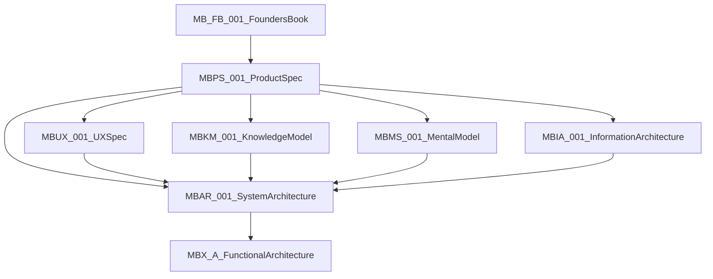

# Memory Box Product Documentation

This folder holds the **product constitution, product definition, domain specifications, and UX specification**. Engineering architecture under [`docs/architecture/`](../architecture/README.md) is subordinate to these documents.

## Document hierarchy (binding)

| Order | Doc | Answers |
|-------|-----|---------|
| 1 | [MB-FB-001 Founder's Book](MB-FB-001%20Memory%20Box%20Founders%20Book.md) | Why / philosophy / ethics / what Memory Box is not |
| 2 | [MBPS-001 Product Specification](MBPS-001%20Memory%20Box%20Product%20Specification.md) | WHAT the product is: goals, concepts, capabilities, flows, v1 out-of-scope |
| 3a | [MBUX-001 User Experience Specification](MBUX-001%20Memory%20Box%20User%20Experience%20Specification.md) | Experience behavior: curator, modes, conversation, trust presentation |
| 3b | [MBKM-001 Knowledge Model](MBKM-001%20Memory%20Box%20Knowledge%20Model.md) | Conceptual vocabulary of a life |
| 3c | [MBMS-001 Mental Model](MBMS-001%20Memory%20Box%20Mental%20Model.md) | Anchors vs supporting concepts vs lenses |
| 3d | [MBIA-001 Information Architecture](MBIA-001%20Memory%20Box%20Information%20Architecture.md) | Entry points, discovery loop, layers, modes |
| 4 | [MBAR-001 System Architecture](../architecture/MBAR-001%20Memory%20Box%20System%20Architecture.md) | Technology-neutral system boundaries, flows, authority, provenance, deployment models |
| 5 | [MBX-A-* Functional Architecture](../architecture/README.md) | HOW functionally (elaborations under MBAR): layers, query model, reconstruction, learning, data model |

**Conflict rule:** Higher documents win on product intent. Domain peers under MBPS (MBUX · MBKM · MBMS · MBIA) own their domains; when definitions clash, see [MB-RECONCILE-001](MB-RECONCILE-001%20Core%20Terminology%20and%20Principles.md). **MBAR-001** parents MBX-A-*. MBX-A-* must not knowingly violate higher product documents or MBAR. Where MBX-A-* is more specific on Evidence-First mechanics (Facts / Observations / Inferences / Unknowns), that specificity stands unless a higher document contradicts it. UX may present those labels in human language (MBUX forbids raw “Confidence 71%” style copy).

## Binding reconciliation

| Doc ID | Title | Status |
|--------|--------|--------|
| [MB-RECONCILE-001](MB-RECONCILE-001%20Core%20Terminology%20and%20Principles.md) | Core Terminology and Principles | Binding — glossary, principles map, conflict register |

## Canonized product documents

| Doc ID | Title | Version | Status |
|--------|--------|---------|--------|
| [MB-FB-001](MB-FB-001%20Memory%20Box%20Founders%20Book.md) | Memory Box Founder's Book | 0.91 | Governing |
| [MBPS-001](MBPS-001%20Memory%20Box%20Product%20Specification.md) | Memory Box Product Specification | 0.1 | Governing |
| [MBUX-001](MBUX-001%20Memory%20Box%20User%20Experience%20Specification.md) | Memory Box User Experience Specification | 0.9 | Governing (UX) |
| [MBKM-001](MBKM-001%20Memory%20Box%20Knowledge%20Model.md) | Memory Box Knowledge Model | 0.1 | Governing (concepts) |
| [MBMS-001](MBMS-001%20Memory%20Box%20Mental%20Model.md) | Memory Box Mental Model | 0.9 | Governing (mental model) |
| [MBIA-001](MBIA-001%20Memory%20Box%20Information%20Architecture.md) | Memory Box Information Architecture | 0.9 | Governing (IA / discovery) |

## Planned product specifications (from MBPS-001)

| Doc ID | Title | Status |
|--------|--------|--------|
| MBDM-001 | Conceptual Data Model | Planned — derive from MBKM-001 + MB-RECONCILE-001 + MBAR-001; align with MBX-A-003 |
| MBTS-001 | Technical Specification | Planned |

MBKM-001 is canonized. MBDM-001 / MBX-A-003 should align with MBKM + [MB-RECONCILE-001](MB-RECONCILE-001%20Core%20Terminology%20and%20Principles.md) + [MBAR-001](../architecture/MBAR-001%20Memory%20Box%20System%20Architecture.md) rather than forking a separate conceptual model.

## Related

- System architecture: [MBAR-001](../architecture/MBAR-001%20Memory%20Box%20System%20Architecture.md)
- Functional architecture series and reconciliation: [docs/architecture/README.md](../architecture/README.md)
- MBUX reconcile (report): [MBX-A-001-RECONCILE-MBUX](../architecture/MBX-A-001-RECONCILE-MBUX.md)
- Experience storyboards (philosophy validation): [MB-SB-001](MB-SB-001%20Memory%20Box%20Experience%20Storyboards.md)
- Silent demonstration (~15 min, no narrator): [MB-DEMO-001](MB-DEMO-001%20Silent%20Demonstration.md) · [**play demo**](../../application/ui/mockup/demo/index.html)
- Feedback walkthrough (shoppable story): [MB-FW-001](MB-FW-001%20Feedback%20Walkthrough.md) · [**rich media + video**](../../application/ui/mockup/walkthrough/rich.html) · [HTML panels](../../application/ui/mockup/walkthrough/index.html)
- Experience boards (feeling): [MB-XB-001](MB-XB-001%20Experience%20Boards.md) · [boards](../../application/ui/mockup/experience-boards/index.html)
- Experience mockups (supporting actor, not final UI): [MB-EX-001](MB-EX-001%20Experience%20Mockups.md) · [Prototype 1 scenes](../../application/ui/mockup/prototype/index.html) · [gallery](../../application/ui/mockup/experience/index.html)
