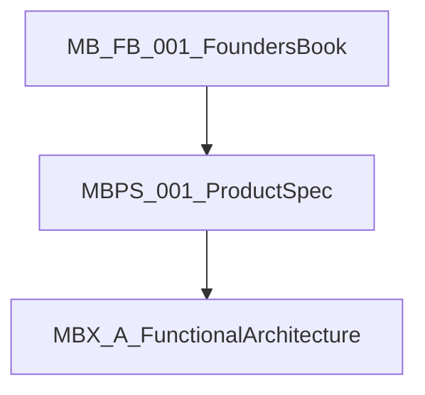

# Memory Box Product Documentation

This folder holds the **product constitution and product definition**. Engineering architecture under [`docs/architecture/`](../architecture/README.md) is subordinate to these documents.

## Document hierarchy (binding)

| Order | Doc | Answers |
|-------|-----|---------|
| 1 | [MB-FB-001 Founder's Book](MB-FB-001%20Memory%20Box%20Founders%20Book.md) | Why / philosophy / ethics / what Memory Box is not |
| 2 | [MBPS-001 Product Specification](MBPS-001%20Memory%20Box%20Product%20Specification.md) | WHAT the product is: goals, concepts, capabilities, flows, v1 out-of-scope |
| 3 | [MBX-A-* Functional Architecture](../architecture/README.md) | HOW functionally: layers, query model, reconstruction, learning, data model |

**Conflict rule:** Higher documents win on product intent. MBX-A-* must not knowingly violate the Founder's Book or MBPS-001. Where MBX-A-* is more specific on Evidence-First mechanics (for example Facts / Observations / Inferences / Unknowns), that specificity stands unless Founder's Book or MBPS contradict it.

## Canonized product documents

| Doc ID | Title | Version | Status |
|--------|--------|---------|--------|
| [MB-FB-001](MB-FB-001%20Memory%20Box%20Founders%20Book.md) | Memory Box Founder's Book | 0.91 | Governing |
| [MBPS-001](MBPS-001%20Memory%20Box%20Product%20Specification.md) | Memory Box Product Specification | 0.1 | Governing |

## Planned product specifications (from MBPS-001)

| Doc ID | Title | Status |
|--------|--------|--------|
| MBUX-001 | User Experience Specification | Planned |
| MBKM-001 | Knowledge Model | Planned |
| MBDM-001 | Conceptual Data Model | Planned |
| MBTS-001 | Technical Specification | Planned |

MBKM-001 / MBDM-001 should align with the personal knowledge graph direction in Functional Architecture Part 3 (MBX-A-003) rather than forking a separate conceptual model.

## Related

- Architecture series and reconciliation: [docs/architecture/README.md](../architecture/README.md)
